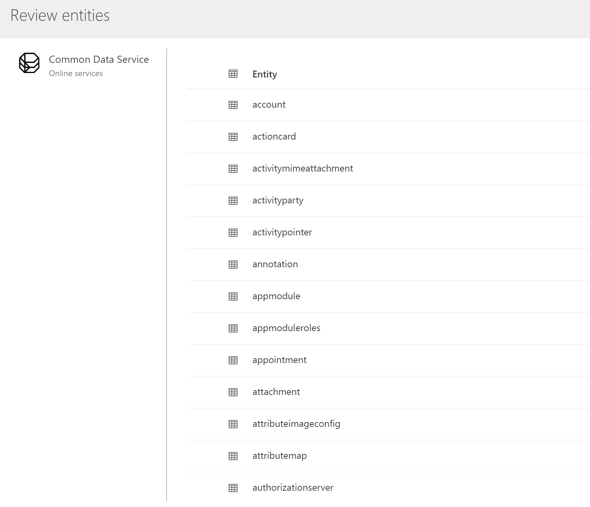

# Connect to data in CDS Managed Lake guidance (preview)

This article provides information on how existing Dynamics customers can quickly connect to their analytical entities available in the CDS Managed Lake from Dynamics 365 Customer Insights.

## Important considerations

- Data stored in online services, such as Azure Data Lake Storage, may be stored in a different location than where data is processed or stored in Dynamics 365 Customer Insights. By importing or connecting to data stored in online services, you agree that data can be transferred to and stored with Dynamics 365 Customer Insights. [Learn more at the Microsoft Trust Center.](https://www.microsoft.com/trust-center)

## Connect to a Common Data Service managed lake

1. In Customer Insights, go to **Data** > **Data sources**.

2. Select **Add data source**.

3. Select **Connect to Common Data Service** and select **Next**.

4. Enter a **Name** for the data source and select **Next**.

5. Provide the **Server address** for your Common Data Service org, and select **Sign in**.
      > 
   
   > [!NOTE]
   > You must be an admin on the CDS Org to be able to proceed further and see the list of entities available in the managed lake.

6. Once you are authenticated against the CDS org, you'll get a list of available entities in the CDS org.
  - Select the entities you want to use in Customer Insights from the available list. 
  - You may notice that some entities are already enabled, this could be because they may have been enabled already by other insights applications for their scenarios. 
  - You cannot unselect an entity if it is already selected i.e., enabled for analytics. 
  - Those already enabled entities will be available for usage in Customer Insights once the data source is created.

   > 
   
7. After saving your selections, these selected entities will start to be synced to the CDS Managed Lake from CDS Org. You will be taken to the **Data sources** page and will see the newly added CDS managed lake connection as a data source. It may be in ‘Pending’ or ‘Refreshing’ state and show the entities count as 0 until all the entities are synced to the lake and are available for consumption in Customer Insights.

8. A CDS managed lake can only associate with one data source in the instance. Meaning, two data sources cannot point to the same CDS managed lake in any given instance.

## Edit a Common Data Service managed lake data source

You cannot edit the Common Data Service managed lake data source connection details once it is created. Only **Edit** option available here is to select additional entities to consume in the Customer Insights. 
To connect to a different CDS Org, [create a new data source connection](#connect-common-data-service-managed-lake).

1. In Customer Insights, go to **Data** > **Data sources**.

2. Next to the data source you'd like to update, select the ellipsis.

3. Select the **Edit** option from the list.

4. Optionally, select additional entities from the available list of entities and select **Save**.
  - This will also cover the scenario of any additional entities getting added to your CDS org, and those entities getting included in Customer Insights by default. Those new entities will not be included in CI unless you explicitly select them as well or make sure that the data source is manually edited.
