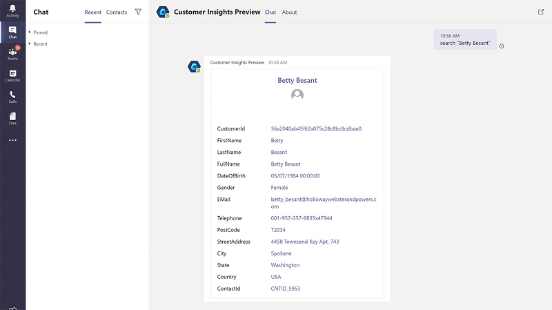

# Bot for Microsoft Teams (preview)

Connect Dynamics 365 Customer Insights with Teams to let a bot look up unified customer profiles in Teams channels.

> [!div class="mx-imgBorder"]
> 

## Prerequisites

To set up and configure the bot, the following prerequisites must be met:

- There's at least one [data source added](pm-data-sources.md).
- The [unification process](pm-configure-data.md) is complete.
- Fields are added to the [search and filter index](pm-manage-search.md).
- Customer Insights and Teams are in the same organization.

## Configure the bot

1. In Customer Insights, go to **Admin** > **Export Destinations**.
1. On the Microsoft Teams tile, select **Set up**.
1. You're redirected to the **Apps** area in Teams. You can also open Teams and select **Apps** in the bottom-left corner or [get it from AppSource](https://go.microsoft.com/fwlink/?linkid=2124104) directly.
1. Search for **Customer Insights** and select the app.
1. Select **Add**.
1. After signing in to Customer Insights in Teams, you'll see a welcome message and can get started.

## Things you can do with the bot

The bot provides lookup capabilities for unified customer profiles.

- Enter **search** followed by a name, email address, or any other field on the unified customer profile that is added to the search and filter index.

  You'll get a card with up to 15 fields from the resulting customer profile. Multiple matches return a list of results where you can select a profile. You can add the search term in double quotes to look up an exact match.

- If your organization maintains multiple Customer Insights instances in the same org, you can enter **switchinstance** to choose which instance you want to connect the bot to.

- Enter **help** to see a list of available commands for the bot.  
