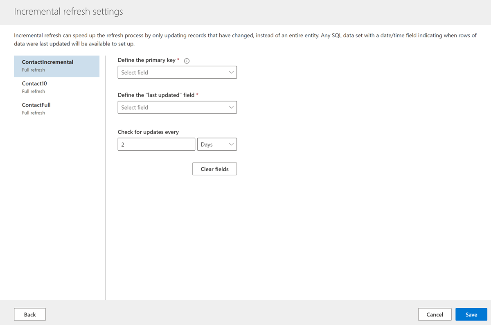

# Incremental refresh for large data sources

Refreshing new and updated data for data sources in Customer Insights provides the following advantages:

- **Faster refreshes** - Only data that has changed gets refreshed. For example, only from the past five days of a historical dataset.
- **Increased reliability** - Reduced necessity to maintain long-running connections to volatile source systems reduces the risk of connection issues.
- **Reduced resource consumption** - Less data to refresh reduces the consumption of computing resources.

## Configure incremental refresh

Customer Insights allows incremental refresh for data sources that support incremental ingestion. For example, Azure SQL databases with date and time fields, which indicate when data records were last updated.

1. In Customer Insights, [create a new data source](pm-data-sources.md).

1. Provide a name for the data source.

1. Select a data source that supports incremental refresh. For example, Azure SQL database.

1. Select the entities or tables to ingest into Customer Insights and transform the data.

1. Complete the transformation steps and select **Next**.

1. In the **Set up incremental refresh** dialog box, select **Set up** to open the **Incremental refresh settings** where you can configure the refresh process. If you select **Skip**, the data source will include the entire data set when it's refreshed.
   > [!TIP]
   > You can also apply incremental refresh later by editing an existing data source.

1. On **Incremental refresh settings**, you'll configure the incremental refresh for all entities here that you selected when creating the data source.

   > [!div class="mx-imgBorder"]
   > 

1. Select an entity, and provide the following details:

   - **Define the primary key**: Select a primary key for the entity/table.
   - **Define the "last updated" field**: This field will only display date/time attributes. Select an attribute that indicates when the records were last updated.
   - **Check for updates frequency**: Specify how often you want the system to check updates.

1. Select **Save** to complete the creation of the data source. The initial data refresh will be a full refresh. Afterwards, the incremental data refresh happens as configured in the previous step.
