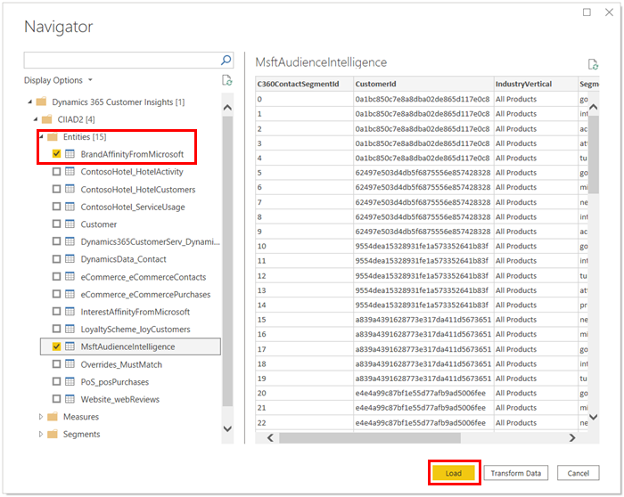

# Connector for Power BI

Create visualizations for your Customer Insights data with the Power BI Desktop Add-in. Generate additional insights and build reports with your unified customer data.

## Prerequisites

- You have unified customer profiles in Customer Insights.
- [Microsoft Power BI Desktop](https://powerbi.microsoft.com/desktop/) is installed on your computer. [Learn more about Power BI Desktop](https://docs.microsoft.com/power-bi/desktop-what-is-desktop).
- The Customer Insights and the Power BI instance are in the same organization and you have access to both services.

## Configure the connector for Power BI

1. In Power BI Desktop, select **File** > **Get Data**.

1. Select **See more** and search for **Dynamics 365 Customer Insights**

1. Select the result and select **Connect**.

1. **Sign in** with the same organizational account you use for Customer Insights and select **Connect**.

1. In the Navigator dialog box. you see the list of all Customer Insights instances you have access to. Expand an instance and open the **Entities** folder to see all entities you can import.

   

1. Select the check boxes next to the entities to include and **Load**. You can select multiple entities from multiple environments.

1. You'll see a loading dialog box while your entities are loaded. Once all of your selected entities have loaded, you can use the capabilities of Power BI on Customer Insights data.

