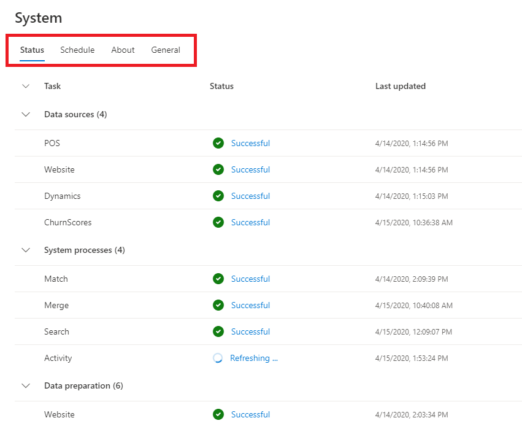

# System

The **System** page contains everything that administrators need to closely monitor the various processes running behind the scenes of Customer Insights. It includes four tabs: **Status**, **Schedule**, **About**, and **General**.

> [!div class="mx-imgBorder"]
> 

> [!NOTE]
> If your data sources are updated on a regular basis, we highly recommend that you use the **Schedule** tab. Make sure to review the "Schedule tab" section later in this topic.

## Status tab

The **Status** tab lets you track the progress of data ingestion and several important product processes. Use this tab to ensure the completeness of any major process you've defined in Customer Insights. This tab includes a table with separate sections for each type of refresh task that has been and could be run in your environments, including tables for Data sources, System processes, and Data preparation. These refresh tasks align with the entities in your system.

The table has three columns. The left column specifies the name of task and its corresponding entity. The middle column defines the status of the current or last run of that task, and the right column specifies when the task was last updated.

You can view the details of the last several runs of the task by clicking on its name.

Clicking the status of a task will show you the progress details of the entire job it was in.

## Schedule tab

Use the **Schedule** tab to schedule automatic refreshes of all your ingested Customer Insights data. This helps ensure that updates from your data sources are reflected in your unified customer profile.

1. In Customer Insights, go to **Admin** > **System** and select the **Schedule** tab.

2. The default state for data refreshes is **Off**. To enable scheduled refreshes, change the toggle at the top of the screen to **On**.

3. Choose between **Weekly** (default) and **Daily** refreshes. If you intend to schedule weekly refreshes, select one or more days on which you want to run the refresh.

4. Select the **Time** field. In the timer dropdown, use the arrows to set your refresh timing. When you're finished, select **Set**. If you'd like to schedule multiple refreshes in a single day, select **Add another time**.

5. Select **Save** to apply your changes.

## About tab

The **About** tab contains your organization's **Display name**, the active **Instance name**, and the **Region**. If you have more than one work instance, you should give each an easily identifiable name.

## General tab

Only one option, **Language**, is currently available on the **General** tab. Supported languages appear in this menu. Select **Save** to apply your changes.
