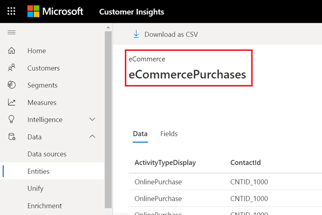

# Real-time data ingestion

The near real-time functionality lets you see the latest interactions that your customers have made with your products or services within seconds.

In Customer Insights scheduled refreshes include large number of records and several complex operations. First, data get pulled from the data source into Customer Insights. Next, the data is unified. Then, it's enriched with additional information. Every run of this process can take minutes to hours.

The real-time functionality provides data immediately for consumption in Customer Insights, until the subsequent scheduled refresh pulls this data from the data source.
Real-time updates have an expiration time and are therefore not a replacement for scheduled refreshes.

## Real-time creation of activities

The real-time feature can be used by building your own pipeline and connecting to the Customer Insights real-time API.

This API lets you publish a new activity from your source system (an individual source record) to a unified customer profile in Customer Insights. The new activity will be available as a [unified activity in your timeline](pm-activities.md) within seconds. You can see the timeline in the customer card view in Customer Insights or any other timeline integration you configured.

You can post an activity in the format of your source system or in the UnifiedActivity format.

Activities ingested through the real-time API expire and will only be kept for 30 days. If you want them to be included in Customer Insights for longer you need to ensure that they also get added to the data source. This will pull them during the next scheduled refresh of Customer Insights.

Following the same logic, activities added only through the real-time API are not part of exports and won't show up in PowerBI either.

> [!NOTE]
>
> - Activities are immutable. They don't change once created.
> - Currently, segments and measures won't update based on the new activity.

## Connect directly to the real-time API

Details of this API, including parameters and responses, can be found in the *EntityData** section on the [Swagger UI page](https://global.api.ci.ai.dynamics.com/swagger/index.html). [Learn more about how to use the Customer Insights Swagger webpage](pm-apis.md#how-to-use-the-customer-insights-swagger-webpage).

### Example of a call to the real-time API

### Prerequisites

- A Customer Insights instance
- [Unified customer profiles](pm-profiles.md)
- [Activities configured and run](pm-activities.md)
- Authenticating account requires Contributor or Admin role

1. Follow the steps to use Swagger in production.

2. On that page, go to the **EntityData** endpoint and select the **POST** /api/instances/{instanceId}/data/{entityName} action.

3. Select **Try it out**.

4. In the field **instanceId**, enter your instance ID which you find in the URL of your Customer Insights instance, or in **Settings** > **Environments**.

5. Under relative path, enter the name of the entity you chose. For example, UnifiedActivity.    
You can find all entities in Customer Insights on **Data** > **Entities**.

   > [!div class="mx-imgBorder"]
   > 

6. Under entity (request body) enter the new activity as a json object. The format of the entity in the request body is the same as the one received when performing a GET call on this resource.

   All the fields of the json object sent in the request body can be seen in the **Fields** tab on the selected entity in **Data** > **Entities**.
