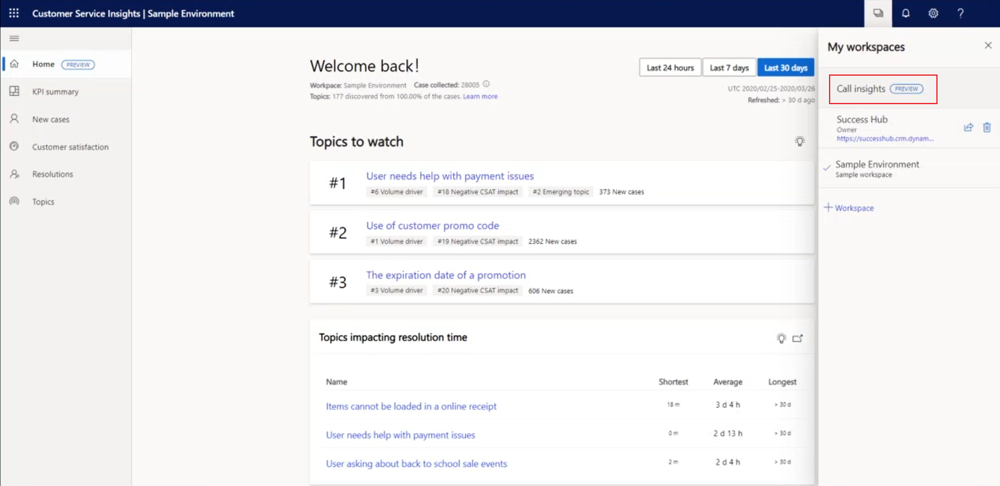
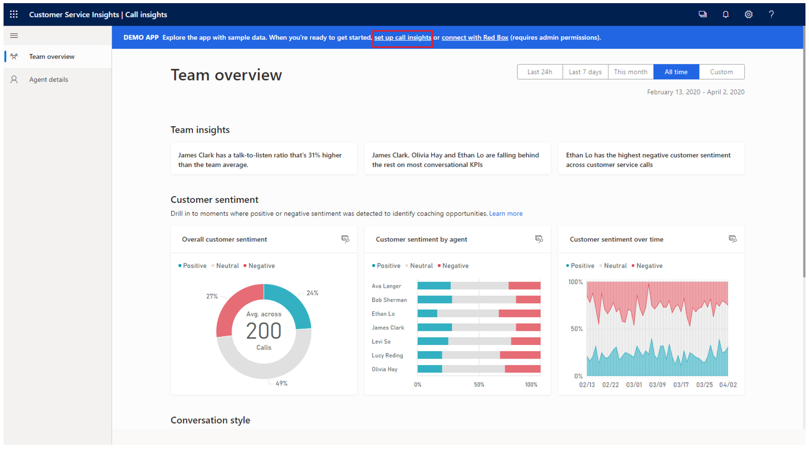
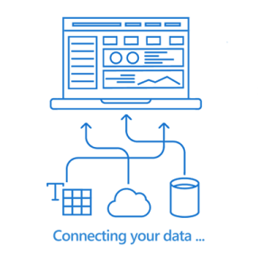

# First-run setup experience for call insights

[!INCLUDE cc-beta-prerelease-disclaimer]

When you sign in to Customer Service Insights for the first time, you can use and explore the various call insights features through the provided demo data.

Depending on your role:

-	As an administrator, you can set up the complete call insights features, including connecting your Dynamics 365 Customer Service environment, granting app permissions, connecting call data, enabling preview, and defining tracked key words and to use. 

-	As a supervisor or agent, you can access the application with demo data. Ask your administrator to configure call insights so you can view the data relevant to you.

## Administrator setting up application

1.	Review the prerequisites. To learn more, see [Prerequisites to configure call insights](ci-admin-prereqs-app.md).

2.	Sign in to the Dynamics 365 Customer Service Insights application.

3.	Select **My workspaces** > **Call insights (preview)**.

    > [!div class="mx-imgBorder"]
    > 

4.	If you are viewing call insights for the first time, you will see a banner-type message at the top that is prefaced with **DEMO APP: Explore the app with sample data.** To set up call insights, select the **set up call insights** link in the banner message.

    > [!div class="mx-imgBorder"]
    > 

5.	Select your Dynamics 365 environment to connect to. This helps to compute and consolidate the necessary insights about your team.

    > [!div class="mx-imgBorder"]
    > 

6.	In the **Terms and conditions** dialog box, accept the terms and conditions, then select **Agree and continue**.

    > [!div class="mx-imgBorder"]
    > 
 
    The application takes few minutes to connect your data with application and progress dialog box is displayed.
 
    > [!div class="mx-imgBorder"]
    > 
  
7.	On the **Create an application user** dialog box, select **Grant permissions** to create application user to use the application.

    > [!div class="mx-imgBorder"]
    > 
 
    The permission is granted to use the application.

8.	On the **Connect your call data** dialog box, enter the **Storage connection string** and **Container name** and select **Connect**.
    
    To learn more on how to get these values, see [Configure call insights to connect call data](ci-admin-config-call-data.md).

    > [!div class="mx-imgBorder"]
    > 
 
9.	On the **Keyword and product tracking** dialog box, add the keywords and products that you want to track on the call. You can update these keywords and trackers later when your organization requires a change. To learn more, see [Configure keywords and products in conversation content](ci-admin-config-keywords-products.md).

    > [!NOTE]
    > You can also skip adding the keywords and products and add them later when required.

    > [!div class="mx-imgBorder"]
    > 
 
10.	Select **Finish** to complete the call insights configuration for your organization.

    The status message will be displayed on the top of the page.
  
Now, your call insights feature is ready, and supervisors and agents can use it to view the data.

### See also

[Overview of call insights](ci-overview.md)

[Prerequisites to use call insights](ci-admin-prereqs.md)

[Configure call insights to connect call data](ci-admin-config-call-data.md)

[Configure keywords and products to track](ci-admin-config-keywords-products.md)

[Connect to Dynamics 365 Customer Service environment](ci-connect-customer-service-env.md)

