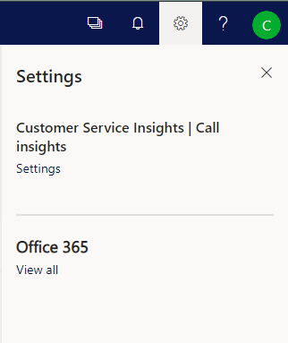
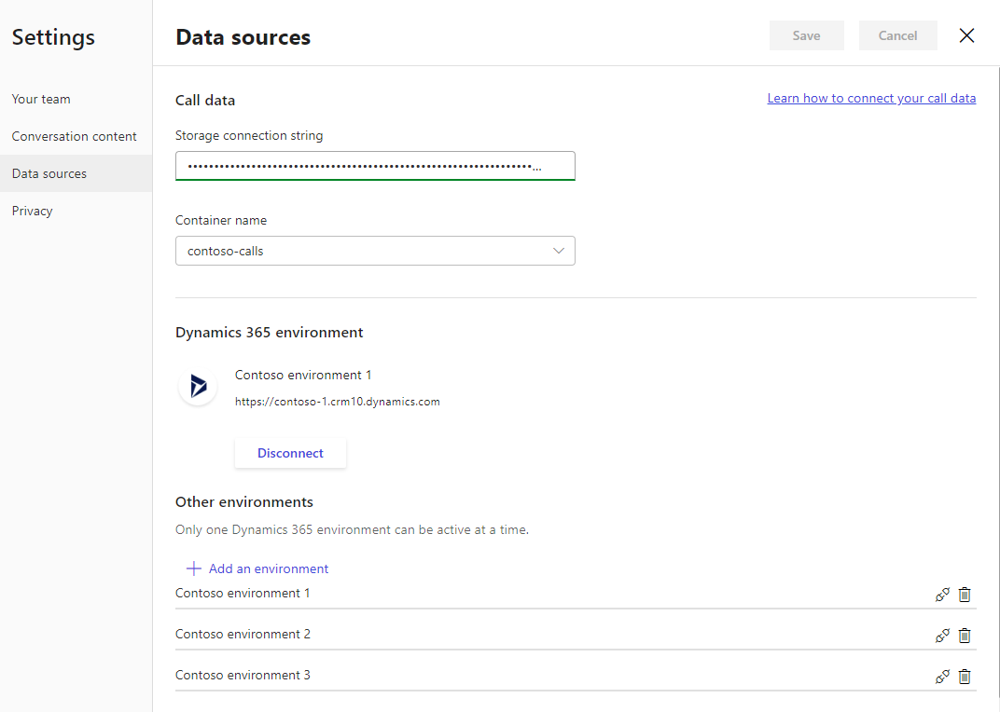
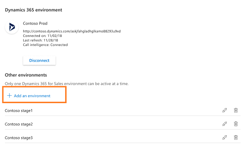
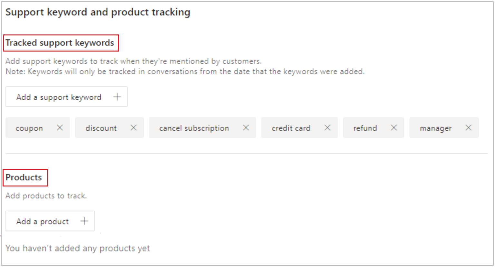

# Connect to Dynamics 365 Customer Service environment

The **Data sources** section helps you to disconnect or connect a Dynamics 365 Customer Service environment with call insights. If you have multiple environments in your organization and want to activate another environment to display data in the application, use this section. 

At a time, you can have only one active Dynamics 365 Customer Service environment that is connected to the application. When you activate an environment, the existing environment will automatically deactivate, and the new environment’s data will be displayed on the application. Also, you must add tracked keywords and products, as well as provide permission to access the data to the added environment.

As an administrator, you must configure the Dynamics 365 Customer Service environment to connect to call insights.

1.	Review the prerequisites. To learn more, see [Prerequisites to configure call insights](ci-admin-prereqs.md).

2.	Open **Call insights (Preview)** in the Customer Service Insights application. 

3.	Select the **Settings** icon on the top-right of the page and then select **Settings**.

    > [!div class="mx-imgBorder"]
    > 

4.	On the **Settings** page, select **Data source**. 

    > [!div class="mx-imgBorder"]
    > 
 
5.	In the **Dynamics 365 environment** section, select **+ Add an environment**.

    > [!div class="mx-imgBorder"]
    > 
 
6.	In the **Connect your data** dialog box, select your Dynamics 365 Customer Service environment to connect with the application.

    > [!div class="mx-imgBorder"]
    > 

    The application now detects your environment.

7.	In the **Terms and conditions** dialog box, accept the terms and conditions, and select **Agree and continue**.

    > [!div class="mx-imgBorder"]
    > 
 
    The application takes few minutes to connect your data with the application, and a progress dialog box is displayed.

    > [!div class="mx-imgBorder"]
    > 
 
8.	In the **Create an application user** dialog box, select **Grant permissions** to create an application user.

    > [!div class="mx-imgBorder"]
    > 
 
    > [!NOTE]
    > If you have already added this environment, the step to grant permissions for the application to access the data will be skipped.

9.	In the **Connect your call data** dialog box, enter the **Storage connection string** and **Container name**, and then select **Connect**. To learn more on how to get the **Storage connection string** and **Container name** values, see [Configure conversation intelligence to connect call data](configure-conversation-intelligence-call-data.md).

    > [!div class="mx-imgBorder"]
    > 
 
10.	In the **Keyword and product tracking** dialog box, add the keywords and products that you want to track on calls. You can update these keywords and trackers later when your organization requires a change. To learn more, see [Configure keywords and products to track](ci-admin-config-keywords-products.md).

    > [!div class="mx-imgBorder"]
    > 
    
   > [!NOTE]
   > You can skip adding the keywords and competitors and add them later, when required.

11.	Select **Finish** to complete the setup of the **Conversation Intelligence** application for your organization. The status message will be displayed on the top of the page.

    > [!div class="mx-imgBorder"]
    > 
  
Now, your call insights feature is ready with the data of the added environment.

### See also

[Discover insights about AI-based call data](ci-overview.md)

[Prerequisites to use call insights](ci-admin-prereqs.md)

[First-run setup experience](ci-admin-fre-setup.md)

[Configure call insights to connect call data](ci-admin-config-call-data.md)

[Configure keywords and products to track](ci-admin-config-keywords-products.md)
