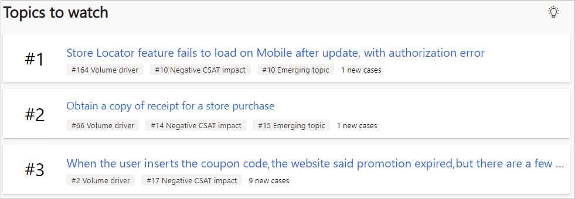
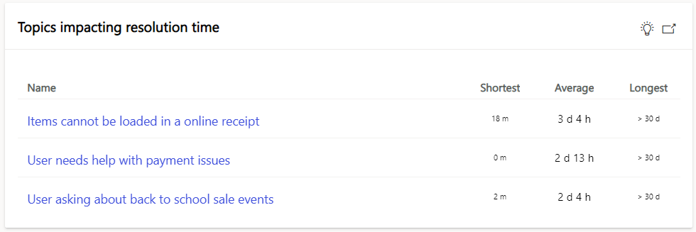

# Discover key insights from your customer service data

The home page of Dynamics 365 Customer Service Insights presents insights from your customer service data in a visually rich way, making it easier to discover topics and issues to focus on and see why they were suggested.

The home page is the landing page experience when you open Customer Service Insights. The home page is also available on the navigation pane, along with four dashboards and the topics page.

The top of the home page includes workspace information, such as the number of cases imported, the number of topics discovered, and the percentage of cases that were successfully clustered to discover the topics.

* **Workspace** name of your environment with your customer service data.
* **Case collected** number of total cases imported into this workspace, using the method of all cases created in the last 60 days or up to 1 million cases, whichever is greater. More information: [Service limits in Dynamics 365 Customer Service Insights](https://docs.microsoft.com/dynamics365/ai/customer-service-insights/service-limits)

* **Topics** number of topics discovered from percentage of total imported cases that were successfully clustered based on semantic similarity. If no topics are discovered, it could be caused by multiple reasons such as not enough case data in the workspace, or clustering is still in progress. More information: [Manage and improve AI grouping of support cases as topics](https://docs.microsoft.com/dynamics365/ai/customer-service-insights/topics-page#troubleshooting-empty-topics-page)

* **Time period selectors** enable comparison between the selected time period and the previous period to see how KPIs are changing over time, as well as across different time ranges. The default selection is **Last 7 days**, based on the creation date of cases imported since the last refresh.
  * Last 24 hours
  * Last 7 days
  * Last 30 days
* **Time period range** based on the selected time period, this shows the time range (in UTC time zone) of the imported cases that were used to discover topic issues shown on the page.  
* **Refreshed date** this timestamp indicates when the workspace was last refreshed, cases created up until the last refresh date are imported to the workspace, which are used to calculate AI and BI insights. 

## Topics to watch

Topics ranked high across these three key areas are shown in **Topics to watch** to make it easier for customer service managers to discover top issues:
  
* **Volume driver** Topics with the largest volume of cases created in the selected time period.
* **Negative CSAT impact** Topics that have the most negative impact on your total CSAT score. CSAT is data collected from surveys.
* **Emerging rate** Get a "heads-up" on topics with high rate of new incoming cases in the selected time period.

When you select the light bulb, a short inline explanation of the reason for showing these topics is displayed with recommendations of possible actions to take.

### Topics impacting resolution time

Focusing on average resolution time (the difference between when a case is created and when it is resolved), these topics are based on similar cases that took a long time to resolve. Shortest and longest resolution times are shown for comparison with the average resolution time to help you understand the whole picture.

When you select the light bulb, an inline explanation is displayed. The link takes you to the **Resolutions dashboard** for more topics and metrics about resolution time.

### Consider automating these topics

A chatbot solution is a great way to automate incoming cases that are easy to resolve and high in volume. Suggested topics are based on these factors. When your organization uses Power Virtual Agents, the topic automation process is an easy integration with Dynamics 365 Customer Service Insights. More information: [Automate topics for a Power Virtual Agents bot](https://docs.microsoft.com/dynamics365/ai/customer-service-insights/automate-topics).

### Topics impacting CSAT by channel

Customer satisfaction score is crucial for using data to determine how satisfied your customers are. Because topics come from various channels, the channel with the lowest CSAT score is shown along with the topics that affect the low CSAT score the most.

### Peak time with high case volume

You can determine the peak time (in UTC time zone) for new incoming cases. The topics that occur during this time period are shown so you can ensure the staffing schedule is aligned to peak hours and issues.

