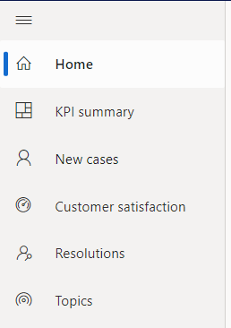
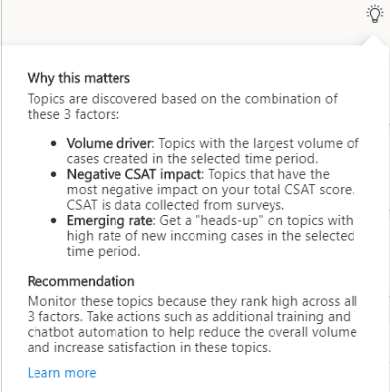

# Discover key insights from your customer service data

The home page of Dynamics 365 Customer Service Insights presents insights from your customer service data in a visually rich way, making it easier to discover topics and issues to focus on and see why they were suggested.

The home page is the landing page experience when you open Customer Service Insights. The home page is also available on the navigation pane, along with four dashboards and the topics page.

The top of the home page includes workspace information, such as the number of cases imported, the number of topics discovered, and the percentage of cases that were successfully clustered to discover the topics.

- **Workspace:** Is the name of your environment that includes<!--Suggested.--> your customer service data.
- **Case collected:** Is the number of total cases imported into this workspace, calculated by using the method of all cases created in the last 60 days or up to 1 million cases, whichever is greater. More information: [Service limits in Dynamics 365 Customer Service Insights](service-limits.md)
- **Summary:** Is the number of topics discovered from a percentage of the total imported cases that were successfully clustered based on semantic similarity. If no topics are discovered, it might be because there isn't enough case data in the workspace or clustering is still in progress. More information: [Manage and improve AI grouping of support cases as topics](topics-page.md#troubleshooting-empty-topics-page)
- **Time period selectors:** Let you compare the selected time period and the previous period to see how KPIs are changing over time and across different time ranges. The default selection is **Last 7 days**, based on the creation date of cases imported since the last refresh. The available time periods are:
  - **Last 24 hours**
  - **Last 7 days**
  - **Last 30 days**
- **Time period range:** Shows the date range in Coordinated Universal Time (UTC) of the imported cases that were used to discover topic issues shown on the page.  
- **Refreshed:** Is the time stamp that indicates when the workspace was last refreshed. Cases that were created up until the last refresh date are imported to the workspace, and are used to calculate AI and BI insights.

## Topics to watch

Topics that rank high across the following three key areas are shown under **Topics to watch**, to make it easier for customer service managers to discover top issues:
  
- **Volume driver** shows topics with the largest volume of cases created in the selected time period.
- **Negative CSAT impact** shows topics that have the greatest negative impact on your total CSAT score. CSAT data is collected from surveys.
- The emerging rate gives you a "heads-up" about topics that have a high rate of new incoming cases in the selected time period.

When you select the light bulb, a short inline explanation of the reason for showing these topics is displayed with recommendations of possible actions to take.

### Topics impacting resolution time

These topics have a higher negative impact on the overall average resolution time from all cases, which means that agents took longer to handle cases that are classified into these topics than other cases. The shortest and longest resolution times are shown for comparison with the average resolution time to help you understand the whole picture.

When you select the light bulb, an inline explanation is displayed. The link takes you to the **Resolutions dashboard** for more topics and metrics about resolution time.

### Consider automating these topics

A chatbot solution is a great way to automate incoming cases that are high in volume and easy to resolve. The topics are suggested based on these factors. When your organization uses Power Virtual Agents, the topic automation process is an easy integration with Dynamics 365 Customer Service Insights. More information: [Automate topics for a Power Virtual Agents bot](automate-topics.md)

### Topics impacting CSAT by channel

Customer satisfaction score is crucial for using data to determine how satisfied your customers are. Because topics come from various channels, the channel with the lowest CSAT score is shown along with the topics that have the greatest effect on the low CSAT score.

### Peak time with high case volume

You can determine the peak time (in UTC) for new incoming cases. The topics that occur during this time period are shown so you can ensure the staffing schedule is aligned to peak hours and issues.

