# Insight cards reference

Insight cards help keep you up to date with your work in Dynamics 365 Sales, letting you know when you need to follow-up on an email, attend a meeting, and much more. They're displayed throughout the application to provide relevant information for the context you're working in. The cards are generated by the assistant based on data stored in Dynamics 365 Sales and your [!INCLUDE[pn_Exchange](../includes/pn-exchange.md)] inbox and calendar. This topic lists each of the available cards and provides details about what each card does, how it gets generated, and how you can use it. More information: [Use Sales Insights Assistant to guide customer communications](assistant.md)

> [!NOTE]
> Your system administrator must enable the assistant before you can try it out. For prerequisites, how to enable the feature, and how to set it up, see [Configure Sales Insights Assistant](configure-assistant.md).  

The assistant displays cards in the following categories:

- [Upcoming meetings](#upcoming-meetings)

- [Reminders](#reminders)

- [Insights](#insights)
  
## Upcoming meetings

The following cards are available under **Upcoming meetings**.

<table class="tg">
  <tr>
    <td><a href="#MeetingToday">Meeting today/Meeting today (Exchange)</td>
    <td><a href="#UpcomingMeeting">Upcoming meeting/Upcoming meeting (Exchange)</a></td>
    <td><a href="#RelatedNEWS">Related news</a></td>
  </tr>
  <tr>
    <td><a href="#NearbyCustomers">Nearby customers</a></td> 
    <td></td>
    <td></td>
  </tr>
</table>

|Insight card	| Description |
|-------------|-------------|
|**Meeting today**     **Meeting today (Exchange)**  | **Description**: Tells that you have a meeting scheduled for today.  The **Meeting Today** card is derived from your appointments in Dynamics 365 Sales organization.  The **Meeting Today (Exchange)** card is derived from you **Exchange** server. **Features**: Shows the meeting title, with a link to the meeting record. Shows the meeting description, location, start time, and key participants Open the detailed view to see the regarded entity and a collection of closely related insight cards, including relevant people, companies, opportunities, near by customers, news, and more. **Actions**:  Open Appointment Email Attendees|
| **Upcoming Meeting**      **Upcoming Meeting(Exchange)**     | **Description**:  Tells that you have a meeting scheduled to start in 30 minutes or less. When available, this card is given highest priority and appears at the top of the stack. That way, you'll have all of your important meeting information available.   The "meeting today" card is similar, but it's shown all day until the meeting ends, provides fewer features, and is given lower priority.  **Features**:  Shows the meeting title, with a link to the meeting record. Shows the meeting description (shortened for space if needed).  Shows the regarding record (with link).  Shows a list of attendees (with link to the full list if there's more than four). Displays a map of the location (if relevant and available; not for online meetings).  Open the detailed view to see a collection of closely related insight cards, including relevant people, companies, opportunities, news, and more. **Actions**:  Join Meeting   Email Attendees |
| **Related News**     | **Description**:  The card displays news headlines related to companies that are participating at the meeting. It's shown in the card details view when you tap a meeting card from the assistant feed.  **Features**:  Shows the date when the news was last updated.  Thumbnail image and headline for each found article. Click to view the full article. |
| **Nearby Customers**    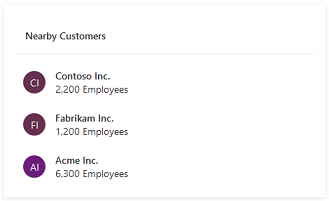| **Description**:  The card finds customers that are located near by the meeting location. It's shown in the card details view when you tap a meeting card from the assistant feed.  **Features**:  Shows the top three near by customers.   Shows basic information about each company.|

## Reminders

The following cards are available under **Reminders**.

<table class="tg">
  <tr>
    <td><a href="#ActivityDueDate"><i>{activity}</i> due today</a></td> 
    <td><a href="#CloseDateComingSoon">Close date coming soon</a></td>
    <td><a href="#MissedCloseDate">Missed (opportunity) closed date</a></td>    
  </tr>
  <tr>
    <td><a href="#EmailOpened">Email opened</a></td>
    <td><a href="#EmailReminder">Email reminder</a></td>
    <td><a href="#NoActivityWithType">No activity with {<i>record type</i>}</a></td>
  </tr>
  <tr>
    <td><a href="#RecentMeetingExchange">Recent meeting/Recent meeting (Exchange)</a></td>
    <td><a href="#ConsentSuggestion">Consent suggestion</a></td>
    <td><a href="#MissedEmail">Missed email</a></td>
  </tr>
</table>

|Insight card	| Description |
|-------------|-------------|
| **{*Activity*} due today**    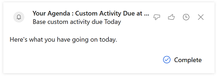 | **Description**:  Tells you that an open activity is due today.  **Features**: Indicates the type of activity (email, letter, phone call, task, or custom).  **Actions**:  Close (for activities, such as phone call and task) Complete|
| **Close date coming soon**     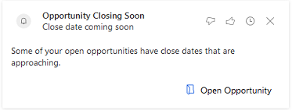 | **Description**:  Tells you that an open opportunity will soon reach its estimated close date.  **Features**:  Identifies the opportunity. Tells how far away the close date is. **Actions**:  Open opportunity **Configuration options**:  Set how many days before the close date to start showing the card. The default value is set by your administrator. **Note**: When you are viewing a dashboard, you'll only see these cards for opportunities that are assigned to you, but when you view a specific opportunity you'll see this card even if that opportunity is assigned to somebody else. |
| **Missed (opportunity) close date**    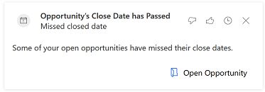 | **Description**:  Tells you that an open opportunity has passed its close date.  **Features**:  Identifies the opportunity. **Actions**:  Open opportunity **Note**: When you are viewing a dashboard, you'll only see these cards for opportunities that are assigned to you, but when viewing a specific opportunity you'll see this card even if that opportunity is assigned to somebody else.|
|**Email opened**    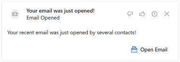 | **Description**:  A followed email was opened by its recipient. **Features**: Names the contact you sent the email to. Provides descriptive text that shows the subject of the email, the time it was opened, and the approximate location where it was opened. **Actions**: Open Email **Prerequisites**: Enable email engagement to use this card. To learn more, see [Configure and enable email engagement](configure-email-engagement.md). |
| **Email reminder**    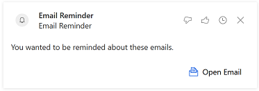 | **Description**:   You set a follow-up reminder for an email you recently sent, and its trigger conditions have just been met. Trigger conditions always include a date but may also include conditionals such as whether the email wasn't opened or replied to by that date. **Features**:  Names the contact that you sent the email to. Tells you that you set a follow-up reminder for this email. Provides a description that summarizes the trigger conditions. **Actions**: Open Email **Prerequisites**: Enable email engagement to use this card. To learn more, see [Configure and enable email engagement](configure-email-engagement.md). |
| **No activity with {*record type*}**     | **Description**: Allows you to know that a record that you own has been inactive for some time. Applies to contact, opportunity, lead, account, and case records. **Features**:  Identifies the type and name of the relevant record. Explains why the card was generated. **Actions**: Open {*record type*} Send Email **Configuration options**:   Set the number of days of inactivity that must pass before a card is generated. You can set a different value for each type of supported record (contact, opportunity, lead, account, and case). |
| **Recent meeting**  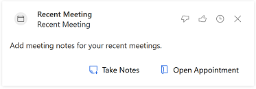 **Recent meeting (Exchange)**  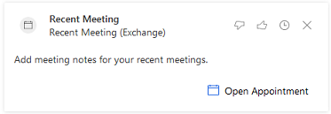 | **Description**:  Tells you that a meeting that you organized (where you are the record owner) has recently ended, giving you an easy opportunity to document the meeting in Dynamics 365 Sales. The card is displayed for 30 minutes after the scheduled end of the meeting, and then removed. **Features**: Identifies the meeting. **Actions**: Take Notes (Only for recent meeting) Open Appointment |
| **Consent Suggestion**   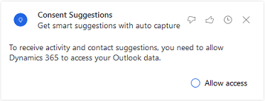 | **Description**: This card allows you to provide consent that allows Dynamics 365 Sales to access your Exchange data so that auto capture can provide suggestions for activities and contacts. **Actions**: Allow Access **Prerequisite**:   Enable premium auto capture to use this card. To learn more, see [How to enable and configure premium auto capture](configure-auto-capture.md#how-to-enable-and-configure-premium-auto-capture).|
| **Missed Email**    | **Description**:   Tells that an important email is unread for configured number of days. **Actions**: Open Email **Configuration options**: The  threshold number of days configurable on Settings page. To learn more, see Assistant. By Default, the number of days for Unread email is 3 days. |

## Insights

The following cards are available under **Insights**.

<table class="tg">
  <tr>
    <td><a href="#OpportunityRiskSentiment">Opportunity at risk (sentiment detection)</a></td>
    <td><a href="#OpportunityRiskPhrase">Opportunity at risk (phrase detection)</a></td>
    <td><a href="#CompetitorMentioned">Competitor mentioned</a></td>
  </tr>
  <tr>
    <td><a href="#IssueDetected">Issue detected</a></td>
    <td><a href="#CustomerQuestion">Customer question</a></td>
    <td><a href="#MeetingRequested">Meeting requested</td>
  </tr>
  <tr>
    <td><a href="#FileRequested">File requested</a></td>
    <td><a href="#BuyingIntentDetectedEmail">Buying intent detected in email</a></td>
    <td><a href="#SuggestedStakeholder">Suggested stakeholder</a></td>
  </tr>
  <tr>
    <td><a href="#SuggestedActivities">Suggested activities</a></td>
    <td><a href="#SuggestedContacts">Suggested contacts</a></td>
    <td><a href="#ContactMovedToNewOrg">Contact moved to a new org</a></td>
  </tr>
  <tr>
    <td><a href="#TodaysTopPeople">Today's top people</a></td>
    <td><a href="#TodaysTopRecords">Today's top records</td>
    <td><a href="#UpcomingFlight">Upcoming flight</a></td>
  </tr>

</table>

|Insight card	|  Description |
|-------------|--------------|
|**Opportunity at Risk (sentiment detection)**   | **Description**: Tell you that when an email is received concerning an open opportunity with negative sentiment which can put the opportunity at risk. **Actions**: Open Email Open opportunity.|
|**Opportunity at Risk (phrase detection)**   | **Description**: Tell you that when an email is received concerning an open opportunity contains a phrase which can put the opportunity at risk. **Actions**: Open Email Open opportunity.|
| **Competitor mentioned**  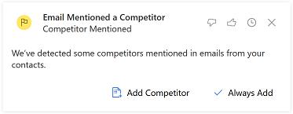 | **Description**:   A tracked email email that is set as regarding a sales opportunity appears to refer to a company that is listed as a competitor in your system.. **Actions**: Add Competitor Always Add **Configuration options**: Set this feature to add the competitor automatically rather than showing the card. **Note**: This is the same as the configuration setting available for this card type, and you can reset it by going to your Assistant settings. To learn more, see [Assistant](assistant.md). |
| **Issue detected**  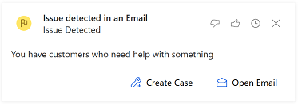 |  **Description**:  An email from a known contact in your inbox appears to include a support request. **Features**: Shows the name of the contact. Tells you that an email that appears to include a support request has arrived. Displays the sentence from the email that appears to be asking for help. **Actions**:  Create Case Open Email |
| **Customer question**  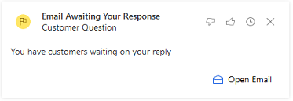 | **Description**: An email from a known contact in your inbox appears to be asking a question. **Features**: Shows the name of the contact. Tells you that a question has arrived. Displays the sentence from the email that appears to be asking a simple question. **Actions**: Open Email|
| **Meeting requested** 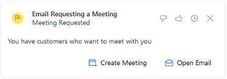 | **Description**:  An email from a known contact in your inbox appears to include a meeting request. **Features**: Shows the name of the contact. Tells you that a meeting request has arrived. Displays the sentence from the email that appears to be asking for a meeting. **Actions**: Create Meeting Open Email |
| **File requested**  | **Description**:  An email from a known contact in your inbox appears to include a request for a file. **Features**: Shows the name of the contact. Tells you that a request for a file has arrived. Displays the sentence from the email that appears to be asking for a file. **Actions**: Open Email |
| **Buying intent detected in email** 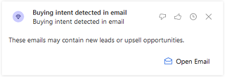 | **Description**:  An email from a known or unknown contact appears to be asking for more information about a product. For known contacts, this may be an upsell opportunity. For unknown contacts, this could be a new lead. **Features**: Shows the name of the sender. Tells you that an email has arrived that may represent an upsell or new-lead opportunity. Displays the sentence from the email that appears to be asking for product information. **Actions**: Open email. |
| **Suggested stakeholder**  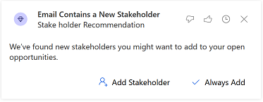 | **Description**:   An email regarding an open opportunity has arrived, and it includes an extra recipient that is not yet listed as a stakeholder for that opportunity. **Features**: Shows the name of the potential stakeholder. Tells you that this person might be a stakeholder in an open opportunity. Displays a short description that includes the name of the opportunity. **Actions**: Add Stakeholder Always Add **Configuration options**: You can choose to add the stakeholder automatically rather than show the card. **Note**: This  is the same as the configuration setting available for this card type, and you can reset it by going to your Assistant settings. To learn more, see [Assistant](assistant.md).|
| **Suggested Activities**   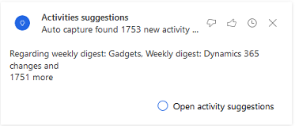 | **Description**:  This card is provided as an alert you when new activity suggestions are available in Dynamics 365 Sales. **Feature**: Indicates that new activities are available for you with the total number and regarding what.  **Actions**:  Open activity suggestions **Prerequisite**:   Enable premium auto capture to use this card. To learn more, see [How to enable and configure premium auto capture](configure-auto-capture.md#how-to-enable-and-configure-premium-auto-capture). |
| **Suggested Contacts**   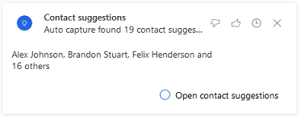 | **Description**:  This card is provided as an alert you when new contact suggestions are available in Dynamics 365 Sales. **Feature**: Indicates that new contacts are available for you with the total number and who.  **Actions**:   Open contact suggestions **Prerequisite**:   Enable premium auto capture to use this card. To learn more, see [How to enable and configure premium auto capture](configure-auto-capture.md#how-to-enable-and-configure-premium-auto-capture). |
| **Contact moved to a new org**   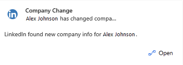 | **Description**: Tells you that one of your contacts has moved to a new organization based on the information LinkedIn has. **Features**: Indicates the contact that moved, what the origin company is and the new organization. **Actions**: Open  **Prerequisite**:   Enable Linkedin Sales Navigator to use this card. To learn more, see [Install, enable, and disable default LinkedIn Sales Navigator controls](https://docs.microsoft.com/dynamics365/linkedin/install-sales-navigator). |
| **Today's Top People**  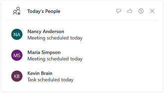 | **Description**:  The system analyzes your appointments, tasks, and other work for the day and generates this card to show the contacts you're most likely to interact with today. **Features**: Shows each contact's name and portrait. Shows each contact's title and any business they have with you today (such as a meeting, task, or phone call). Click to view full contact details. |
| **Today's Top Records** 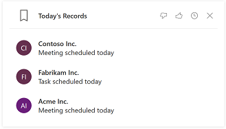 | **Description**:  The system analyzes all of the Sales records that are related to you and lists the records that you are most likely to be working with today based on your recent activities and date information (such as a due date or appointment) in each record. **Features**:  Shows a thumbnail image and a summary of each found record. Click to view the full record. |
| **Upcoming Flight**    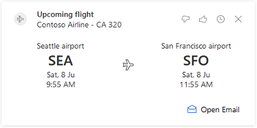 | **Description**:  This card is generated when your Exchange inbox includes an email message that contains a flight confirmation. The system then matches the flight dates to upcoming meetings and finds other information related to the location that you are flying to, such as other nearby customers. **Note**: This card doesn't show live or updated flight information, just information from the flight confirmation email message that triggered the card. **Features**:  Flight company and flight number, with a link to the flight record. Departure and arrival times, with airport codes. Related meeting record, with link. Up to three meetings may be listed here. List of customer offices near the destination airport, with links.  **Actions**: Open Email |

### See also

[Use Sales Insights Assistant to guide customer communications](assistant.md)
