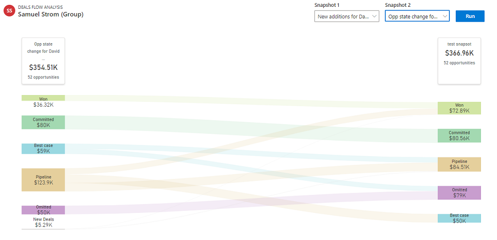

# Analyze deals flows between snapshots

> [!NOTE]
> This is an early access feature. You can opt in early to enable these features in your environment, which will allow you to test these features and then adopt them across your environments. 
> For information about how to enable these features, see Opt in to 2020 release wave 1 updates [Opt in to 2020 release wave 1 updates](https://aka.ms/EarlyAccessOpt-in)

The **Flow** chart provides a visual representation of how the forecast changes between two moments in time. Managers can use flow charts to drill into the specific deals that have contributed to the increase or decrease in forecast commitment, thus enabling them to follow up with their teams and coach their teams on how to improve their forecast accuracy.

Review the following prerequisite before you start using deals flow analysis:

-	Verify that at least two snapshots have been created for the forecast. To learn more, see [Manage snapshots for a forecast](manage-snapshots-forecast.md).

## View a deals flow

1.	Sign in to the Sales Hub app.

2.	At the bottom of the site map, select the **Change area** icon, and then select **Sales**.

3.	Under **Performance**, select **Forecasts**.

4.	Select the forecast, and then choose a forecast period for the forecast.

5.	Select the **Flow** tab.

    A Sankey chart is displayed, showing the comparison between the two latest snapshots for the selected forecast.

    > [!div class="mx-imgBorder"]
    > 

## Choose snapshots to compare

To compare snapshots, choose a snapshot from **Snapshot 1** and one from **Snapshot 2**. The list of available **Snapshot 2** dates only shows snapshots that are newer than the one selected in **Snapshot 1**.

> [!div class="mx-imgBorder"]
> 
 
After you choose the snapshots, select **Run**. The chart is updated to display the deal flow.

## Analyze snapshots in the chart

The chart has two data categories: **Snapshot 1** is shown in the stack in the leftmost column and **Snapshot 2** is shown in the stack in the rightmost column. 

> [!NOTE]
> When you select a user to view the flow chart and the flow chart isn't displayed, the user is added to the hierarchy after **Snapshot 1** is taken. An error message appears, stating that there is no data available for the selected user.

The order of forecast categories depends on how the forecast columns are arranged in the grid view. The **Won** forecast category is always on top, and **Lost** is at the bottom.

> [!div class="mx-imgBorder"]
> 

### Characteristics of a column

-	The topmost stack in the column displays a summary of the snapshot such as the name, aggregated opportunity amount, and the number of opportunities that are influencing the aggregated amount.

-	The other columns on the stack display the forecast categories and the aggregated opportunity amount for that snapshot in the order defined when the forecast was configured.

-	If any underlying opportunities are added to the forecast while Snapshot 2 is being taken and these opportunities aren't available in Snapshot 1, a **New Deals** forecast category is added to the bottom of the Snapshot 1 column stack.

-	If any underlying opportunities are deleted from the forecast after Snapshot 1 is taken and these opportunities aren't available in Snapshot 2, a **Slipped Deals** forecast category is added to bottom of the Snapshot 2 column stack.

### View summary and flow

-	When you hover over a forecast category in the stack, a summary of the category is displayed, including the forecast category with snapshot name, the aggregated budget amount, and the number of opportunities that are influencing the aggregated amount. Also, the flow is highlighted to show how the opportunities are trending between the snapshots.

-	This flow depends on how the status of the opportunity in a forecast category of Snapshot 1 changed to the other forecast category in Snapshot 2. If there's no change in the status of the opportunity, the flow remains the same between forecast categories in the snapshots.

### View underlying opportunities

-	When you select the forecast category, all the underlying opportunities that are influencing the budget amount are displayed. You can select a flow and all the underlying opportunities that are trending from the Snapshot 1 forecast category to the Snapshot 2 forecast category.

-	In the opportunities grid, you can see the side-by-side comparison of how the granular data for each opportunity&mdash;such as owner, value, date, and forecast category&mdash;is changing in columns from Snapshot 1 to Snapshot 2.

-	You can't edit the opportunities inline. However, you can select and open the opportunity in an opportunity form and make the necessary changes. The saved changes won't affect the status of the opportunity in the snapshot, because the snapshots are taken at a moment in time by using frozen data.

> [!div class="mx-imgBorder"]
> 

## Whose deals flow am I viewing?

You can identify whether the selected flow is for a team or an individual by looking at the deals flow heading:

-	If the heading name contains **Username (Group)**, you're looking at a user's team's deals flow.

-	If the heading name contains only **Username**, you're looking at an individual user's deals flow.

The deals flow of other users that you can see depends on the sales hierarchy defined for you. To learn more, see [Forecasts and sales hierarchy](https://docs.microsoft.com/dynamics365/sales-enterprise/view-forecasts#forecasts-and-sales-hierarchy).

### See also

[Manage snapshots for a forecast](manage-snapshots-forecast.md) 
[About predictive forecasting](configure-premium-forecasting.md)