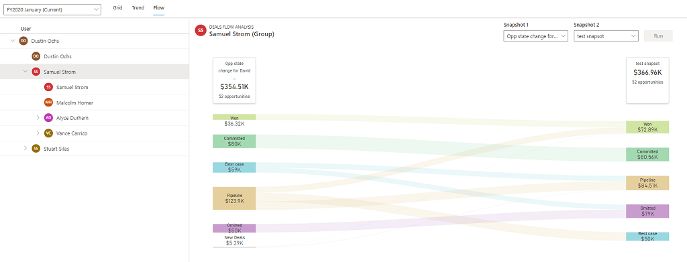

# Analyze deals flow between snapshots

The **Flow** chart provides a visual representation of how the forecast changes between two moments in time. This allows managers to drill into the exact deals that have contributed to the increase or decrease in forecast commitment, thus enabling them to follow up with their teams and coach them to improve their forecast accuracy.

Review the following prerequisite before you start using deals flow analysis:

-	Verify that at least two snapshots are created for the forecast. To learn more, see [Manage snapshots for a forecast](manage-snapshots-forecast.md).

## View deals flow

1.	Sign in to the **Sales Hub** app.

2.	At the bottom of the site map, select the **Change area** icon, and then select **Sales**.

3.	Under **Performance**, select **Forecasts**.

    The forecast view page displays.

4.	Select the forecast and choose a forecast period for the forecast.

5.	Select **Flow** tab.

    A Sankey chart displays with the comparison between the two latest snapshots for the selected forecast.

    > [!div class="mx-imgBorder"]
    > 

## Choose snapshots to compare

To compare snapshots, choose a snapshot from **Snapshot 1** and then one from **Snapshot 2**. The dropdown of available **Snapshot 2** dates shows only the snapshots that are newer than the one selected in **Snapshot 1**.

> [!div class="mx-imgBorder"]
> 
 
After you choose the snapshots, select **Run**. The chart is updated to display the deal flow.

## Analyze snapshots in the chart

The chart has two data categories – **Snapshot 1** is shown in the left stack column and **Snapshot 2** is shown in right stack column. 

> [!NOTE]
> When you select a user to view the flow chart and the flow chart is not displayed, then the user is added to the hierarchy after **Snapshot 1** is taken. An error message displays stating that there is no data available for the selected user.

The order of forecast categories depends on how the forecast columns are arranged in the grid view. The Won forecast category is always on the top Lost at the bottom.

> [!div class="mx-imgBorder"]
> 

### Characteristics of a column

-	The topmost stack in the column displays a summary of the snapshot such as the name, aggregated opportunity amount, and the number of opportunities that are influencing the aggregated amount.

-	The other columns on the stack display the forecast categories and the aggregated opportunity amount for that snapshot in the order defined while configuring the forecast.

-	If any underlying opportunities are added to the forecast, while taking a snapshot 2 and these opportunities are not available in snapshot 1, then a **New Deals** forecast category is added to the bottom of the snapshot 1 column stack.

-	If any underlying opportunities are deleted from the forecast, after taking the snapshot 1 and these opportunities are not available in snapshot 2, then a **Slipped Deals** forecast category is added to bottom of the snapshot 2 column stack.

### View summary and flow

-	When you place the cursor on a forecast category in the stack, a summary of the category displays, such as forecast category with snapshot name, the aggregated budget amount, and the number of opportunities that are influencing the aggregated amount. Also, the flow highlights to show how the opportunities are trending between the snapshots.

-	This flow depends on how the status of the opportunity in a forecast category of snapshot 1 changed to the other forecast category in snapshot 2. Also, if there is no change in opportunity status, the flow remains the same between forecast categories in the snapshots.

### View underlying opportunities

-	When you select the forecast category, all the underlying opportunities that are influencing the budget amount is displayed. Also, you can select a flow and all the underlying opportunities that are trending from the snapshot 1 forecast category to the forecast category of snapshot 2.

-	In the opportunities grid, you can see the comparison (side-by-side) on how each opportunity’s granular data, such as owner, value, date, and forecast category, is changing in columns from snapshot 1 to snapshot 2.

-	You can't edit the opportunities inline. However, you can select and open the opportunity in an opportunity form and make necessary changes and save. The saved changes will not affect the status of the opportunity in the snapshot as the snapshots are taken at a moment in time with frozen data.

> [!div class="mx-imgBorder"]
> 

## Whose deals flow am I viewing?

You can identify whether the selected is for a team or an individual by looking at the deal flow heading.

-	If the heading name contains Username (Group), then you are looking at a user’s team deal flow.

-	If the heading name contains only Username, then you are looking at an individual’s deal flow.

Also, the deals flow of other users that you can see depends on the sales hierarchy defined for you. To learn more, see [Forecasts and sales hierarchy](/sales-enterprise/view-forecasts#forecasts-and-sales-hierarchy).

### See also

[Manage snapshots for a forecast](manage-snapshots-forecast.md)

[About premium forecasting](configure-premium-forecasting.md)