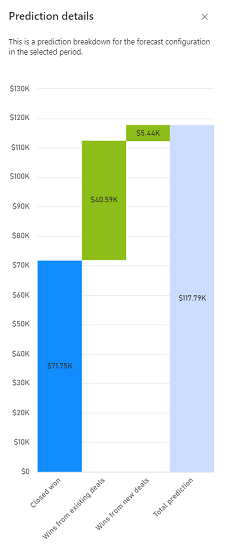

# Analyze revenue outcome by using predictive forecasting

[!INCLUDE [cc-beta-prerelease-disclaimer](../includes/cc-beta-prerelease-disclaimer.md)]

> [!IMPORTANT]
> - [!INCLUDE[cc_preview_features_definition](../includes/cc-preview-features-definition.md)]  
> - [!INCLUDE[cc_preview_features_expect_changes](../includes/cc-preview-features-expect-changes.md)]
> - Microsoft doesn't provide support for this preview feature. Microsoft Technical Support won’t be able to help you with issues or questions. Preview features aren't meant for production use and are subject to a separate [supplemental terms of use](https://go.microsoft.com/fwlink/p/?linkid=870960).

Predictive forecasting helps sellers and managers improve their forecast accuracy by providing forecast projections based on data. To achieve this, predictive forecasting uses AI-driven models that look at historical data and the open sales pipeline to predict future revenue outcome.

## Prerequisites

Review the following prerequisite before you start using predictive forecasting:

  -	Ensure that the predictive forecasting feature is enabled and a forecast is configured accordingly. To learn more, see [About predictive forecasting](configure-premium-forecasting.md).

## Understand the Prediction column and details in a forecast

The **Prediction** column shows the predicted revenue for each seller and manager. Predictions are based on the **Status** field of an opportunity. To optimize the accuracy of the predictions, ensure the **Forecast Category** values are kept in sync with the **Status** field. For the out-of-the-box forecast category, a workflow ensures that when an opportunity is closed as **Won** or **Lost**, the forecast category is updated with the proper value. 

> [!NOTE]
> If there's not enough data for predictive forecasting to work, it displays an error with an empty value in the column. 

### Prediction column

Open a forecast that includes a **Prediction** column. To learn more, see [View a forecast](https://docs.microsoft.com/dynamics365/sales-enterprise/view-forecasts). 

The following screen shows an example of a **Prediction** column. 

> [!div class="mx-imgBorder"]
> 

When you hover over the information icon on the column header, the last recalculation date of the prediction is shown. Predictions are recalculated every seven days.

### Prediction details

Select a value in the prediction column to display the **Prediction details** pane.

  > [!div class="mx-imgBorder"]
  > 

The prediction details graph consists of the following values:

-	**Closed won**: Total number of opportunities that have already been closed during the current forecast period.

-	**Wins from existing deals**: Total number of existing opportunities that are predicted to close during the current forecasting period.

-	**Wins from new deals**: Total number of new opportunities that are predicted to close during the current forecasting period.

-	**Total prediction**: Total predicted amount for the current forecasting period.

### See also

[About predictive forecasting](configure-premium-forecasting.md)
