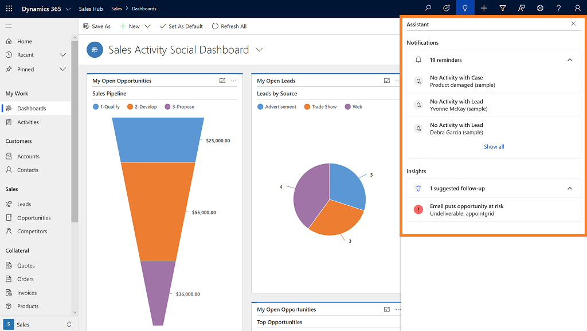
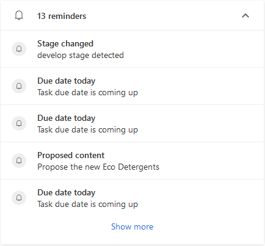
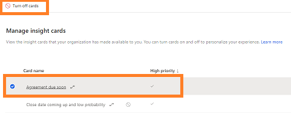

# Use the assistant to guide customer communications

The assistant (formerly known as relationship assistant) is part of Dynamics 365 Sales Insights. The assistant keeps an eye on your daily actions and communications, and helps you stay on top of your day with insight cards that are displayed prominently throughout the application to provide tailored and actionable insights. 

The assistant reminds you of upcoming activities, by:

-	Evaluating your communications, and notifies you when a contact or account has been inactive for a while.

-	Identifying email messages that may be waiting for a reply.

-	Alerting you when an opportunity is nearing its close date and much more.
  
>[!NOTE]
>The administrator must enable assistant before you can try it out. For complete details about prerequisites, how to enable the feature, and how to set it up, see [Configure Assistant](configure-assistant.md).

## How and where the assistant can help you  

The assistant works by analyzing the data at its disposal and generating a collection of insight cards, each of which includes a message, summarizing what the card is about, plus a set of actions. The assistant sorts the cards by priority and filters them for your current context.

The assistant is available on the application in the following ways:

>[!NOTE]
>The assistant on the application may vary depending on the configuration set by your administrator. 

-	**Navigation bar**: Select the bulb icon to open the assistant and the insight cards are displayed in a pane. The following screen is an example of assistant displayed on navigation bar:

   > [!div class="mx-imgBorder"]
   > 

-	**Dashboards**: An assistant widget is displayed on **Sales Activity Social Dashboard** dashboard.

-	**Entities**: An assistant widget displays insight cards related to the following entities – accounts, contacts, leads, opportunities, and cases. The following screen is an example of assistant widget displayed on dashboards and entities:

   > [!div class="mx-imgBorder"]
   > 

## What cards do I see?

-	When you open the assistant through the navigation bar or dashboard, you'll see the cards that are relevant to you.

-	When you open the assistant through a record, you'll see the cards that are related to that record. 

## Categorization of insight cards

Typically, the insight cards are categorized into notifications and insights, which help you to understand whether to take actions immediately or to view for information and act later.

-	**Notifications**: Displays insight cards about your upcoming, and past-due items and events. The notifications include meetings and reminders sections.
   
   The **upcoming meetings** section displays the cards on meetings that are scheduled for the current day.
   
   The **reminders** section displays the cards that require your attention.
   
   >[!NOTE]
   >Custom insight cards created by your organization through Assistant Studio are displayed as reminders.

-	**Insight**: Displays suggestions based on AI-driven models for things that requires your attention. For example, the suggestions include an email with a potential negative sentiment that puts an opportunity as risk, prioritize an opportunity, suggest a cross-sale, and prompt to look at auto capture recent items.

### Characteristics of assistant categories

By default, top five insight cards are displayed on the assistant in each category. Select Show more to view more available cards. The heading displays the total number of insight cards that are available for you or for the record you're associated with in each category.

In this example, we're viewing the **reminders** category. The heading specifies that there's a total of 13 reminders available and the latest five are displayed with basic information. 

> [!div class="mx-imgBorder"]
> 

To view complete details of the activity, select the card. In this example, we've selected the meeting **Stage changed** and the detailed information of the change is displayed. Further, you can select **Open** to view more details.

> [!div class="mx-imgBorder"]
> 

Also, you can perform action on cards, such as open activity, snooze, dismiss, like, or dislike the card. To learn more, see [Elements of an insight card]().

## Elements of an insight card

When you open the assistant, it typically displays basic information such as names and description. To further view the detailed information of the cards, select and open the card.

> [!div class="mx-imgBorder"]
> 

Typically, an insight card is made up of the following elements, as labeled in the figure:

1.	**Main content area**: Shows the title of the record the card refers to, its summary, the card type, and other basic information.

2.	**Actions area**: Provides convenient links that will help you complete whatever type of action the card is recommending. The number (up to two) and types of links provided here vary by card type. To learn more, see [Insight cards reference](action-cards-reference.md).

3.	**Snooze**: Select the button to hide card temporarily. Snooze time varies by card type. Once the snooze time expires the card will again be visible. The snooze time of cards varies from 5 minutes to 12 hours depends on the type of card.

4.	**Dismiss**: Select the button to dismiss card permanently, regardless of whether you've completed the action it recommends.

   >[!NOTE]
   >- When you snooze or dismiss a card, a confirmation message displays for a specified time. If you do not undo before the time expires, the card will automatically be snoozed or dismissed. You can configure the time to display the confirmation message. To learn more, see [Configure Sales Insights Assistant](configure-assistant.md).
   >- After a certain period of time, insight cards will be automatically dismissed if there is no action performed on the cards.

5.	**Feedback**: Helps you to provide feedback on how useful the card is for you. Select thumbs-up icon if the card is useful for you or select thumbs-down icon if it’s not. The feedback helps Microsoft and your organization administrators to improve the card experience and make it more helpful for you. To learn more, see [View card usage metrics](edit-insight-cards.md#view-card-usage-metrics).

## Manage insight cards

You can configure the assistant by choosing which types of insight cards you'd like to see or hide. 

>[!NOTE]
>You can configure certain cards, such as **No activity with a record**, where you can display the card when there is activity for the set number of days on the record. These configuration will override the administrator configuration and is applicable only for you.

1.	Sign in to the **Dynamics 365 Sales Hub** app.

2.	At the bottom of the site map, select **Change area**, and then select **Sales Insights settings**.

3.	Select **Personal settings** and under **Assistant studio**, select **Insight cards**.

   The **Manage insight cards** page appears with the list of insight cards that are ordered by status and priority.

   > [!div class="mx-imgBorder"]
   > 

   - **Turn on a card**: Choose a card that is turned off and then select **Turn on cards**.  

      Alternatively, you can select the **More options** icon on the card and then select **Turn on card**. 
      
      The turned off icon is displayed on turned off cards.

      > [!div class="mx-imgBorder"]
      > 

      >[!NOTE]
      >You can select multiple cards that are turned off and then turn on simultaneously. 

   - **Turn off a card**: Choose a card that is turned on and then select **Turn off cards**. The card is turned off and will not be displayed for you. 

      Alternatively, you can select the **More options** icon on the card and then select **Turn off card**. 
      
      > [!div class="mx-imgBorder"]
      > 

      >[!NOTE]
      >You can select multiple cards that are turned on and then turn off simultaneously. 

### See also  

[Configure Assistant](configure-assistant.md)

[Insight cards reference](action-cards-reference.md)