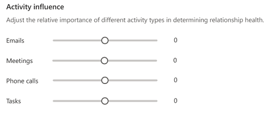
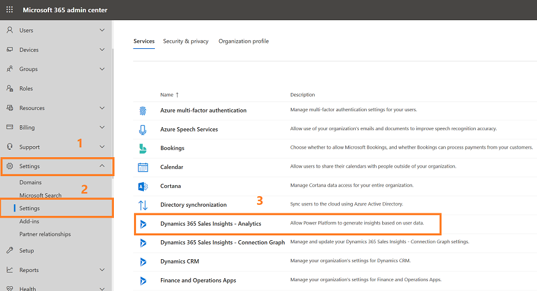

# Configure Relationship analytics

Relationship analytics provides graphical representation of KPIs and activity histories for any contact, opportunity, lead, or account to the users. 

To configure Relationship analytics, follow these steps:

1. Verify that advanced Sales Insights features are enabled. To learn more, see [Enable and configure advanced Sales Insights features](intro-admin-guide-sales-insights.md#enable-and-configure-advanced-sales-insights-features) 

2. Go to **Change area** and select **Sales Insights settings**.

    > [!div class="mx-imgBorder"]
    > 

3. On the site map, select **Relationship analytics** under **Connection insights**.<!--Unless the tip shows a more convenient way to get to the configuration page, you don't need it. Procedures are meant to be a guided passage through the UI, not describe every possible path through it.-->

    > [!TIP]
    > Alternatively, in the **Sales Insights settings** page, select **Manage** from the **Relationship analytics** section to go to configuration page.

    The configuration page opens.

4. Select the toggle to enable Relationship analytics for your organization.

    > [!div class="mx-imgBorder"]
    > 

    Relationship analytics is enabled in your organization, and you can configure the parameters as required.

5. (Optional) To enable the preview to view similar opportunities, under **Similar opportunities** on the **Relationship analytics** tab for opportunities, turn on the **Preview enabled** toggle.

    By enabling this option, users in your organization can see an improved Relationship analytics tab for opportunities. The tab displays customer interaction KPIs along with suggestions calculated from similar won opportunities through AI-driven models.

    >[!NOTE]
    >- The preview feature is available only for the Opportunity entity.
    >- You must have at least 30 won and 30 lost opportunities to compare with existing opportunities.
    >- To understand how users use this feature, see [View similar opportunities](relationship-analytics.md#relationship-analytics-with-similar-opportunities).

    > [!div class="mx-imgBorder"]
    > 

6. To show the relationship health score in opportunities, views, and charts, set the toggle to **On**.

    >[!NOTE]
    >You can disable the option if you don't wish to display the score in opportunities, views, and charts. However, disabling the option does not affect the process of gathering the relevant health data.

    > [!div class="mx-imgBorder"]
    > 

7. Adjust the importance of activities of different types as they contribute to the relationship health score.

    Businesses place different emphasis on the type of communication used with customers.The activities includes, Emails, Meetings, Phone calls, and Tasks. 
    
    > [!div class="mx-imgBorder"]
    > 

8. Choose **Communication Frequency**. 

    Businesses have varying sales cycles and different expected levels of communications with customers. A longer expected communications frequency reduces the expectation of more recent frequent communications in the health score. A shorter expected communications frequency increases the expectation of more recent frequent communications in the health score.

    > [!div class="mx-imgBorder"]
    > 

9. Select **Save**.

   Relationship analytics is ready to use in your organization.

Enable the **Dynamics 365 Sales Insights – Analytics** option in the admin center to collect valuable information regarding communications&mdash;such as emails and meetings&mdash;for users in your organization from Exchange server. This data is used in analytics features for salespeople and sales managers. When you enable this, the **Exchange Data** option on the Relationship analytics configuration page is automatically selected. 

To enable Dynamics 365 Sales Insights – Analytics, follow these steps: 

1. Go to the **Admin** center.

    > [!div class="mx-imgBorder"]
    > 

2. Select **Settings** > **Settings** > **Dynamics 365 Sales Insights – Analytics**.

    > [!div class="mx-imgBorder"]
    > 

3. Read the description carefully, select the **Allow org data to be used by ‎Dynamics 365 Sales Insights - Analytics**‎ option, and then select **Save changes**.<!--Is the alt text correct for the following graphic? Seems that it maybe should be "Enable and save Sales Insights preview option"?-->

    > [!div class="mx-imgBorder"]
    > 

    Now you can connect to the Exchange server to collect data.

### See also

[View customer activity history](../sales/relationship-analytics.md)  
[Enable and configure advanced Sales Insights features](intro-admin-guide-sales-insights.md#enable-and-configure-advanced-sales-insights-features)  
[Opt out of relationship analytics (GDPR)](optout-relationship-analytics-gdpr.md)  
[GDPR for Sales Insights](embedded-intelligence-gdpr.md)  
[View and export KPI data (GDPR)](view-export-KPI-data-gdpr.md)  
[Retrieve insights data using msdyn_RetrieveTypeValuesFromDCI action](retrieve-insights-data-msdyn-RetrieveTypeValuesFromDCI.md)
