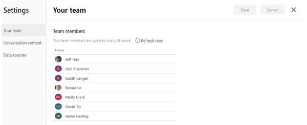

# Configure and view your team page

As an administrator, you can configure the levels of hierarchy for which sales managers can view in Conversation Intelligence application. When configured, sales managers will be able to view the hierarchy under **Your team**.

Let’s look at the example to understand hierarchy levels:

The matrix explains which data you’ll view as a sales manager, for different hierarchy levels. 

> [!div class="mx-imgBorder"]
> 

| Managerial level	| View user hierarchy |
|-------------------|---------------------|
| Level 1 | Choose this option to get insights on your direct team members. |
| Level 2 | Choose this option to get insights on both your direct team members and their direct team members. |
| Level 3 | Choose this option to get insights on level 1, level 2, and level 2’s team members. |

>[!NOTE]
>Conversation Intelligence supports up to three levels of hierarchy. To learn more about hierarchy, see [set up manager and position hierarchies](https://docs.microsoft.com/power-platform/admin/hierarchy-security#set-up-manager-and-position-hierarchies).

## Configure hierarchy levels

1.	Review the prerequisites. To learn more, see [Prerequisites to configure Conversation intelligence application](prereq-sales-insights-app.md).

2.	Open the **Dynamics 365 Conversation Intelligence** application. 

3.	Select the **Settings** icon on the top-right of the page and then select **Settings**.

    > [!div class="mx-imgBorder"]
    > 

4.	On the **Settings** page, select **Your team**. 

5.	Choose the hierarchy level from the **Call data visibility** list to display team members for managers.

    > [!div class="mx-imgBorder"]
    > 

6.	Save and close the settings.

    Sales managers can see the employees in the hierarchy levels as configured.

## View your team

As a sales manager, when you open Your team page in settings, you can view the list of employees who are part of your hierarchy as configured by the administrator. 

>[!NOTE]
>To view this page, sales managers must have a manager hierarchy defined under them, with sellers or individuals added to the hierarchy. Currently, only administrators can change levels of hierarchy. For sales managers to change it, they should contact administrator to change the hierarchy on their behalf.

1.	Open the **Dynamics 365 Conversation Intelligence** application. 

2.	Select the **Settings** icon on the top-right of the page and then select **Settings**.

    > [!div class="mx-imgBorder"]
    > 

3.	On the **Settings** page, select **Your team**. 
    
    > [!div class="mx-imgBorder"]
    > 

    The list is updated every 24 hours to display the current active sellers in managers hierarchy. Also, you can select **Refresh now** to refresh the list right away and view any changes.

### See also

[Prerequisites to use Conversation intelligence application](prereq-sales-insights-app.md)

[Overview of Conversation Intelligence applications](dynamics365-sales-insights-app.md)
