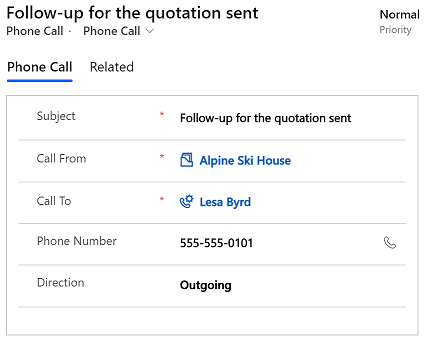
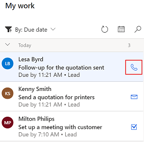
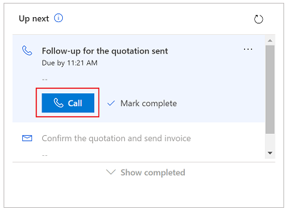
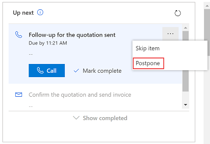

# Connect with customers through a record or the up next widget 

As a seller, you can connect with your customers by using multiple channels, such as phone and email daily without losing context and switching to multiple application. If you have activities to contact customers through a phone call or an email, corresponding icons and buttons of phone and email are displayed in your engagement center and the Up next widget. After you make the phone call or send an email, you must mark the activity as complete in the **Up next** widget and continue with the next activity defined in the sequence.

If an activity is not required to be completed by the due date or you are unable to connect with a customer, you can either skip or postpone the activity. More information: [Skip or postpone an activity](#skip-or-postpone-an-activity)

## Call a customer

You can make a phone call to your customer from the engagement center or the **Up next** widget.

When you make a phone call, a Phone Call activity is created and linked to the lead or opportunity. The Phone Call activity captures the following information:

- **Subject**: Name of the task in the **Up next** widget.
- **Call From**: Name of the contact who made the call.
- **Call To**: Name of the contact to whom the call is made.
- **Phone Number**: Mobile phone number of the contact to whom the call is made.
- **Direction**: Direction of the call. The value will always be **Outgoing**, as the call is made and not received.

> [!div class="mx-imgBorder"]
> 

The mobile phone number   of the contact is used to initiate the call. If the mobile phone number of the contact   is not available, the softphone dialer is displayed,   and you can dial the number manually. If the contact has set the preference not to be contacted through phone, a corresponding message is displayed. After you make the phone call successfully, you must mark the Phone Call activity as complete.  

To make a phone call, do either of the following:

- Select the phone icon in the **My work** list record.

    > [!div class="mx-imgBorder"]
    > 

- Select **Call** in the **Up next** widget activity.

    > [!div class="mx-imgBorder"]
    > 

## Send an email to a customer

You can send an email to your customer from the engagement center or the **Up next** widget. If the email address of a contact is not available, a warning message is displayed. When you send an email, an Email activity is created and linked to the lead or opportunity.

While composing an email, if you try to navigate to another record or send an email from another lead/opportunity, a warning message is displayed to save the email. 

To send an email, do either of the following:

- Select the email icon in the **My work** list record.

    > [!div class="mx-imgBorder"]
    > 

- Select **Email** in the **Up next** widget activity.

    > [!div class="mx-imgBorder"]
    > 

## Skip or postpone an activity

You can skip an activity if it’s not required to be completed by the due date. When you skip an activity, it is removed from the sequence and the next activity is displayed for taking the action. The skipped activity is moved to the completed list. If you skip a manual task, it is marked as cancelled.

If you are unable to connect with a customer on the due date, but need to follow-up at a later date, you can postpone the activity and select the new date and time to connect with the customer.

To skip an activity:

1.	In the **Up next** widget, go to the activity you want to skip.

2.	Select **More actions** > **Skip item**.

    > [!div class="mx-imgBorder"]
    > 

The activity is skipped and the next activity in sequence is displayed.

To postpone an activity:

1.	In the **Up next** widget, go to the activity you want to postpone.

2.	Select **More actions** > **Postpone**.

    > [!div class="mx-imgBorder"]
    > 

3.	Select the new date and time by which the activity should be completed.

    > [!div class="mx-imgBorder"]
    > 

### See also

[Integrate a sample softphone dialer with Dynamics 365 Sales](integrate-sample-softphone.md)