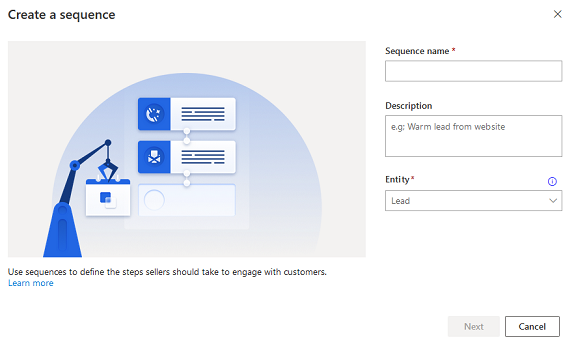
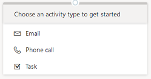
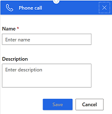
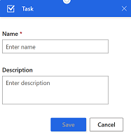
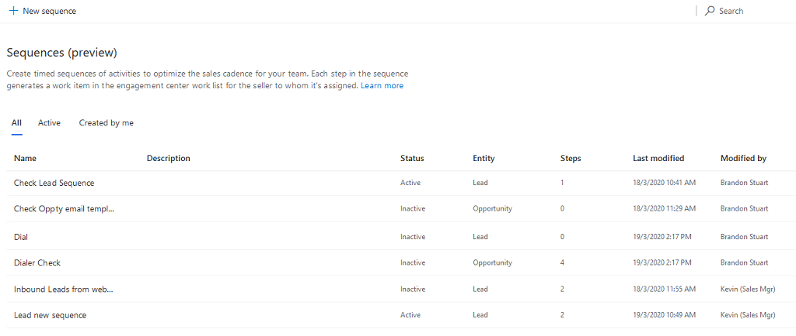
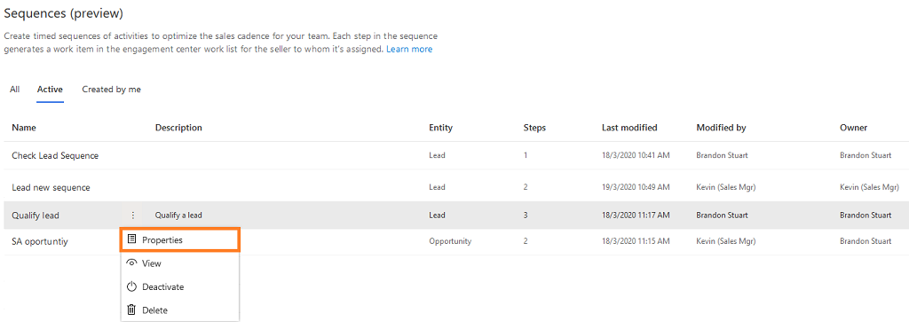
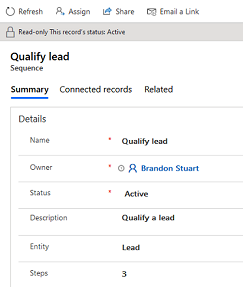
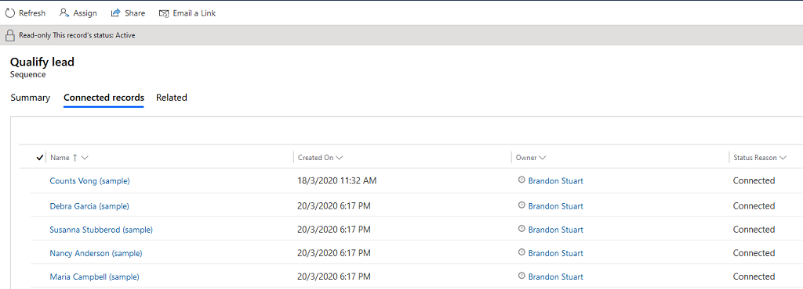
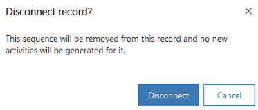
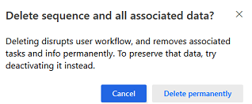

# Create and manage sequences

Sequences help sales managers to enforce best practices by introducing a set of consecutive activities for sellers to follow during their course of day. Leads and opportunities that appear in the work queue can have a sequence connected  to help sellers be more productive and align to processes.

As a sales manager, you can configure sequence which defines activity steps that help sellers to prioritize activities for the day, be productive in their job, and focus on selling. 

Using the sequence designer, sales managers can:   

- [Create and activate a sequence](#create-and-activate-a-sequence)
- [Connect sequence to records](#connect-sequence-to-records)
- [View details of sequences and connected records](#view-details-of-sequences-and-connected-records)
- [Edit sequence](#edit-sequence)
- [Delete sequence](#delete-sequence)

## Review prerequisites

Review the following prerequisites before configuring a sequence:

- You must have the **Sequence Manager** security role. To learn more, see [Assign a security role to a user](https://docs.microsoft.com/power-platform/admin/create-users-assign-online-security-roles#assign-a-security-role-to-a-user).

- Sales accelerator is enabled and installed in your organization. To learn more, see [Enable and configure Sales accelerator](#enable-configure-sales-accelerator.md).

## Create and activate a sequence

Every organization has their own selling processes for sellers to follow. A sequence helps sellers to overcome the inconsistency and lack of documentation through the sales journey. As a sales manager, by creating a sequence, you define activities to display with the best actions to perform on leads and opportunities. By following these activities, sellers can concentrate on selling more and have better understanding on what to do next on their leads and opportunities.

To create and activate a sequence, follow these steps:

1. Sign in to the **Sales Hub** app.

2. At the bottom of the site map, select **Change area** > **Sales Insights settings**.

3. Under **Acceleration**, select **Sequence (preview)**.

    The **Sequences (preview)** page opens.

4. Select **+ New sequence**.

    The **Create a sequence** dialog dox opens.   

    > [!div class="mx-imgBorder"]
    >     

5. On the **Create a sequence** dialog dox, enter the following information:

    | Parameter | Description |
    |-----------|-------------|
    | Sequence name | Name of the sequence. |
    | Description | (Optional) A description for the sequence. |
    | Entity | Entity type for with you want to apply this sequence for. By default, Lead entity type is selected. |

6. Select **Next**.

    The activity creation page opens.  

7. Choose an activity and add as described:    

    > [!div class="mx-imgBorder"]
    >         
    
    - **Email**: Creates an email activity for sellers to communicate with customers. When this activity is shown to the seller, an icon to send an email is displayed on the record. When sellers select the icon, an email composer opens with the selected template. If no template is selected, an empty email composer opens.

        > [!div class="mx-imgBorder"]
        >  

        Enter the following information to configure the email activity:

        a. A name and description for the activity. The information you enter here will be displayed to sellers.

        b. If templates are available for your organization, in the **Assign email template** box, use the lookup and select a template you want to assign for this step.

        c. Save the activity.

         The email activity is saved and created.

         > [!div class="mx-imgBorder"]
         > 

    - **Phone call**: Creates a phone call activity for sellers to communicate with customers. When this activity is shown to the seller, a phone icon is displayed on the record. When sellers select the icon, a softphone appears on the application to dial the customer.

        > [!div class="mx-imgBorder"]
        >  

        Enter a name and description for the phone call activity and select **Save**. The information you enter here will be displayed to sellers. The activity is saved and created.

        > [!div class="mx-imgBorder"]
        >         

    - **Task**: Creates a custom-defined activity, such as scheduling a meeting and meet the customer on the field that are not specified in the activity selector.

        > [!div class="mx-imgBorder"]
        > 

        Enter the name and description  of the custom activity and select **Save**. The information you enter here will be displayed to sellers. The custom activity is saved and created.

        > [!div class="mx-imgBorder"]
        > 

    - **Set wait time**: Creates a time interval between two activities where sellers need to wait after an activity is completed and before the next activity occurs. A sequence can’t start or end with this activity.  

        When this activity is shown to the sellers on a record, sellers don’t need to perform  any action and need to wait until the time of the activity expires to perform the next activity.  

        > [!div class="mx-imgBorder"]
        > 

        Choose the duration in days and hours for which you want sellers to wait until they could perform the next activity. You can select up to a maximum of 30 day wait time. Select **Save**. The activity is saved and created.

        > [!div class="mx-imgBorder"]
        > 

8. Select the Add icon and repeat **step 6** and **step 7** for all the activities that you want to add to the sequence. 

9. Select **More options** on the top right corner of the page and then select **Save**.

    The sequence is saved.

10. Select **More options** again and then select **Activate** to activate the sequence.
    
    A confirmation message is displayed.

11. Select **Yes**.

    >[!NOTE]
    >An error may occur if you have **Set wait time** as the last activity of the sequence. You must delete the last **Set wait time** activity and continue saving and activating the sequence.  
    
    The sequence is activated and is listed in the sequence designer home page.

    > [!div class="mx-imgBorder"]
    >  

Now, you can connect the active sequence to lead or opportunity records.

## Connect sequence to records

After you create and activate the sequence for the selling process, connect  the sequence for the records depending on the entity that you have created the sequence for. When a sequence is connected  to an entity the activities defined in the sequence will be shown according to their order in the record’s **Summary** tab under **Up next** widget in the **My work**.

To connect  sequence to a record, follow these steps:

1. Sign in to the **Sales Hub** app.

2. At the bottom of the site map, select **Change area** > **Sales**.

3. Under **Sales**, select **Leads** or **Opportunities** depending on the records for which you want to connect.

    In this example, we are selecting **Leads**.

    > [!div class="mx-imgBorder"]
    > 
    
4. Select the records for which you want to connect  the sequence. In this example we are selecting **Nancy Anderson** and **Maria Campbell**.

    > [!div class="mx-imgBorder"]
    > 

    >[!NOTE]
    >You can’t connect  sequence to a record that is already associated with a sequence. To change the sequence that is connected with a specific record , remove the record from the existing sequence and then conne ct it. To learn more, see [View details of a sequence and connected records](#view-details-of-sequences-and-connected-records).

5. Select **Connect sequence** and a list of available sequences are displayed. The list includes the sequences created by you and other sales managers.

    In this example, a list of sequences that are configured for **Lead** entity is displayed. 

    > [!div class="mx-imgBorder"]
    > 

6. Select a sequence and then select **Connect**.

    A confirmation message displays at the bottom of the page and the sequence is connected  to the selected lead records. Now, sellers who have access to the lead record can see the activities.
    
## View details of sequences and connected records

You can view the details of a sequence and the records associated with it. This view can also be used to remove records associated with the sequence. Follow these steps:

1. Sign in to the **Sales Hub** app.

2. At the bottom of the site map, select **Change area** > **Sales Insights settings**.

3. Under **Acceleration**, select **Sequence (preview)**.

    The **Sequences (preview)** page opens with a list of available sequences.

4. Select the **Active** tab.

    A list of active sequences is displayed.

    > [!div class="mx-imgBorder"]
    > 
    
5. Hover over a sequence and then select **More options** > **Properties**.   

    > [!div class="mx-imgBorder"]
    > 

    The sequence opens in the summary view. You can view the details of the sequence, such as the name of the sequence, owner, status, the entity that the sequence is associated with, and total number of activities defined.

    > [!div class="mx-imgBorder"]
    > 
    
6. To view assigned records, select **Connected Records** tab.

    A list of records that are assigned to the sequence are displayed.

    > [!div class="mx-imgBorder"]
    > 

7. To remove from the connected sequence, select the record and then select **Disconnect**.

    > [!div class="mx-imgBorder"]
    > 

    A confirmation message is displayed. Select **Disconnect**.

    > [!div class="mx-imgBorder"]
    >     

    The record is removed from the assigned list and can be connected to a different sequence.

# Edit sequence

You can edit sequences that are in inactive state only. Deactivate a sequence before you edit it. For example, the selling process in your organization has changed. To adhere to the latest process, you can edit a sequence to match the new process.

Follow these steps:

1. Sign in to the **Sales Hub** app.

2. At the bottom of the site map, select **Change area** > **Sales Insights settings**.

3. Under **Acceleration**, select **Sequence (preview)**.

    The **Sequences (preview)** page opens with a list of available sequences.

    >[!NOTE]
    >To deactivate a sequence, choose a sequence that is active and then select **More options** > **Deactivate**.

4. Hover over a sequence that is in **Inactive** state and then select **More options** > **Edit steps**.

    > [!div class="mx-imgBorder"]
    > 

    The sequence opens in the sequence designer.

5. You can add or edit existing an activity.

    - To add an activity, perform **step 6** and **step 7** from [Create and activate a sequence](#create-and-activate-a-sequence).
    
    - To edit an activity, select **More options** > **Edit**.

        > [!div class="mx-imgBorder"]
        >     

        Edit the activity as required and then select **Save**. 

6. (Optional) If you want the sequence to be available to assign to records, select **Activate**. 

7. Exit the sequence designer.

## Delete sequence

You can delete sequences that are no more required in your organization and they will be deleted permanently from the application. You can delete both active and inactive sequences. When you delete an active sequence, the records that are associated with it will be disassociated.

To delete sequence, follow these steps:

1. Sign in to the **Sales Hub** app.

2. At the bottom of the site map, select **Change area** > **Sales Insights settings**.

3. Under **Acceleration**, select **Sequence (preview)**.

    The **Sequences (preview)** page opens with a list of available sequences.

4. Hover over a sequence, select **More options** > **Delete**.

    A confirmation message displays.

    > [!div class="mx-imgBorder"]
    > 

5. Select **Delete permanently**.

    The sequence is deleted from the application permanently.

### See also

[Enable and configure Sales accelerator](#enable-configure-sales-accelerator.md)

