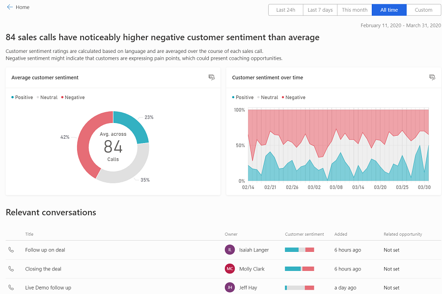
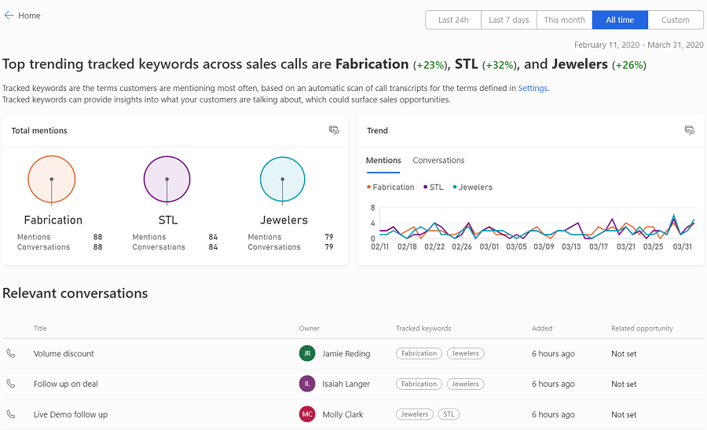
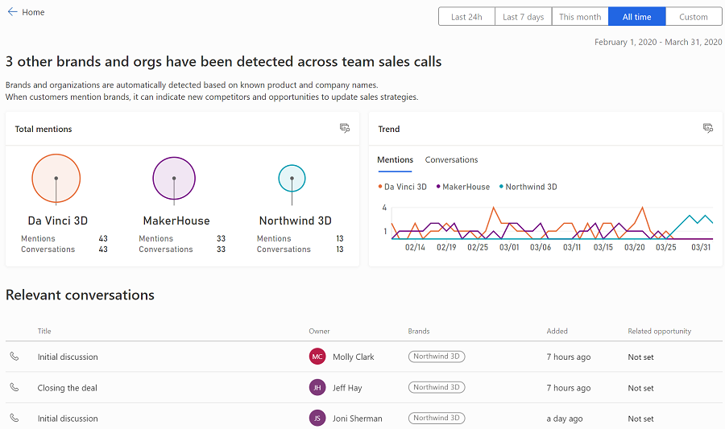
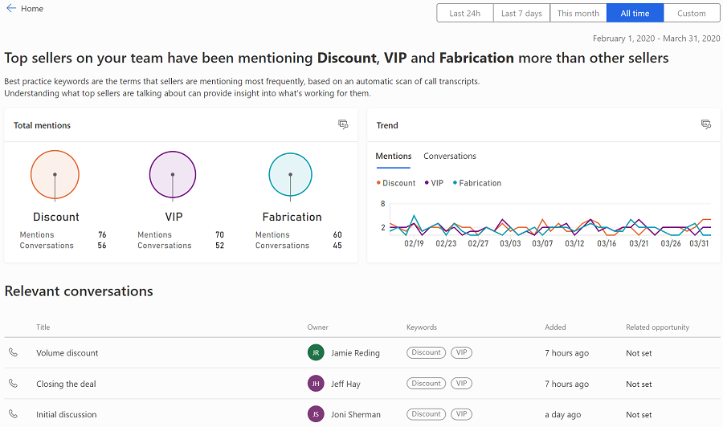

# View and understand home page

When you sign-in to the Dynamics 365 Sales Insights application as a sales manager, you’ll see the home page. This page provides high-level information on the status of your current sales period and insights on what your customers are talking about, behaviors of your top sellers, and the team’s sales pipeline for the selected time period.

Typically, the home page is divided into the following sections:

-	[Time period filter](#time-period-filter)

-	[Base KPIs](#base-kpis)

-	[What are customers talking about?](#what-are-customers-talking-about)

-	[What characterizes top sellers?](#what-characterizes-top-sellers)

-	[Are my team’s deals on track?](#are-my-teams-deals-on-track)

-	[Call recording KPIs](#call-recording-kpis)

## Time period filter

You can filter the information on the home page based on a time period, such as last 24 hours, last seven days, last month, current month, or a custom time period. For example, to view the information of the current month, select **This month**, and the information is filtered to display the current month's status in the **Base KPIs**, **What are customers talking about?**, **What characterizes top sellers?**, and **Are my team’s deals on track?** sections.

> [!div class="mx-imgBorder"]
> 

> [!NOTE]
> By default, the information displayed from the day the application is configured for your organization.

## Base KPIs

The base KPIs provide information on the status of your current sales period. By viewing these KPIs, you’ll know:

-	The time left in the current period to achieve your sales target.

-	The sum of actual revenue of all won opportunities.

-	The total estimated revenues of all open opportunities.

-	The total deals that you won in this period.

-	The percentage of deals that you won against available opportunities in this period.

-	The average revenue generated through each deal in this period.

The following image is an example of how the base KPIs are displayed:

> [!div class="mx-imgBorder"]
> 

## What are customers talking about?

The **What are customers talking about** section helps you to understand what’s happening in sales calls and what customers are talking about. Through these understandings, you can derive coaching scenarios for your sales team so that they could be more efficient during the sales calls. 

This also helps in driving strategic motion by looking at the keywords, brands, and competitors mentioned during the call. For example, "3D printer" is trending more during customer calls, but the 3D printer sales are not reaching targets. You can coach the sales team on how to sell the 3D printers more effectively to customers.

The following insights are available for you to understand what customers are talking about:

-	[Customer sentiment](#customer-sentiment)

-	[Tracked keywords](#tracked-keywords)

-	[Tracked competitors](#tracked-competitors)

-	[Other brands and organizations](#other-brands-and-organizations)

### Customer sentiment

This insight shows the number of calls where the negative customer sentiments are more than average. Using this insight:

- You can analyze pain points that customers express during the call and coach your sellers on how to handle customer conversations well. 
- You can analyze why customers are expressing these pain points and identify selling opportunities by addressing the gaps that are causing pain points. 

The following image is an example of how the customer sentiment insight is displayed:

> [!div class="mx-imgBorder"]
> 

In this example, you can see that 200 calls are analyzed and 27% of calls have higher than the average negative customer sentiment. The doughnut chart shows the percentage of calls that are positive, neutral, and negative.

Select **Show details** to view more details on how the customer sentiment is trending over time and the list of calls that is contributing in analyzing the customer sentiment. Further, you can select each call and view the summary. To learn more about call summary, see [View and understand call summary](view-and-understand-call-summary.md).  

> [!div class="mx-imgBorder"]
> 

### Tracked keywords

This insight shows the tracked keywords that are defined in the application and that customers use the most during the sales calls. The application highlights these tracked keywords in this insight. Using these tracked keywords, you can identify new sales opportunities that are related to them. 

The following image is an example of how the tracked keyword insight is displayed:

> [!div class="mx-imgBorder"]
> 

In this example, you can see that STL (+32%), Jewelers (+26%), and Fabrication (+23%) are most trending keywords, so you will be able to define a sales strategy related to these keywords. The bubbles show the top 20 tracked keywords and the number of times that these keywords were mentioned in calls. 

You can define what keywords you want to track during the sales call. To learn more, see [Configure keywords and competitors to track](configure-keywords-competitors.md).

Select **Show details** to view more details on top trending keywords. The details, such as how many times that each keyword is mentioned in the total number of calls, trend of each keyword over the time, and the list of calls that is contributing in analyzing the keywords. Further, you can select each call and view the summary. To learn more about call summary, see [View and understand call summary](view-and-understand-call-summary.md).

> [!div class="mx-imgBorder"]
> 

### Tracked competitors

This insight shows the defined competitors' names that customers use most and are trending upwards during the sales calls. The application highlights these competitors in this section. Using these competitors, you can identify new sales opportunities that are related to them.

The following image is an example of how the competitors mentioned insight is displayed:

> [!div class="mx-imgBorder"]
> 

In this example, you can see that Contoso 360 (+31%), Engravex (+26%), and Protosystem (+22%) are the most trending competitors, and you can define a sales strategy related to these competitors. The bubbles show the top 20 competitors and the number of times that these competitors were mentioned in the calls. 

You can define what competitors you want to track during the sales call. To learn more, see [Configure keywords and competitors to track](configure-keywords-competitors.md).

Select **Show details** to view more details on top trending competitors. The details, such as how many times that each competitor is mentioned in the total number of calls, trend of each competitors over the time, and the list of calls that is contributing in analyzing the competitors. Further, you can select each call and view the summary. To learn more about call summary, see [View and understand call summary](view-and-understand-call-summary.md).

> [!div class="mx-imgBorder"]
> 

### Other brands and organizations

This insight helps to discover new products, brands, and organizations that customers are speaking about in sales calls, which they never spoke of in previous calls. These products, brands, and organizations are not defined in the application (tracked keywords and competitors), and the application uses Microsoft Bing's knowledge repository to identify the products, brands, and organizations to display. Using this insight, you can identify if any competitor brands and organizations are mentioned on the sales calls and update your sales strategies accordingly.

The following image is an example of how the brands and organizations detected insight is displayed:

> [!div class="mx-imgBorder"]
> 

In this example, you can see that three brands and organizations (Da Vinci 3D, MakerHouse, and Northwind 3D) are trending most in the sales calls. You can update the sales strategies to coach your sales teams to minimize the mention of these brands in the calls. The bubbles show the 20 brands that are used most and the number of times that these brands and organizations were mentioned in the calls. 

Select **Show details** to view more details on top brands and organizations. The details, such as how many times that each brand and organization are mentioned in the total number of calls, trend of each brand and organization over the time, and the list of calls that is contributing in analyzing the brands and organizations. Further, you can select each call and view the summary. To learn more about call summary, see [View and understand call summary](view-and-understand-call-summary.md).

> [!div class="mx-imgBorder"]
> 

## What characterizes top sellers?

The **What characterizes top sellers** section helps you understand the conversational behavior of your top sellers. The insights are generated based on the revenue that the top sellers generate. For example, Bart and John are sellers, and they generate more than average revenue on your team. The insights in this section are generated based on the conversational behavior of Bart and John.

By analyzing these insights, you can understand what makes the top sellers most effective in generating revenue, and you can apply this knowledge to coach other sellers on how to generate revenue more effectively. 

The following insights are available for you to understand what characterizes top sellers:

-	[Average talk to listen ratio](#average-talk-to-listen-ratio)

-	[Best practice keywords](#best-practice-keywords)

-	[Customer sentiment](#customer-sentiment)

-	[Switch rate](#switch-rate)

-	[Engagement with customers](#engagement-with-customers)

### Average talk to listen ratio

This insight shows the average time top sellers spend talking verus listening to customers compared to the rest of the sales team. By analyzing this insight, you can understand what works for top sellers to close deals and generate revenue.

The following image is an example of how the talk-to-listen ratio insight is displayed:

> [!div class="mx-imgBorder"]
> 

In this example, you can observe that the top sellers talk (59%) more than listen (41%) to customers compared to the team’s average of talk (61%) to listen (39%). Through this insight, you can learn that talking more is helping the top seller generate revenue, and you can make it as a best practice for other sellers to follow.

Select **Show details** and the [Teams overview](../sales/conversation-intelligence-team-overview.md) page opens with details on each seller's talk verus listen ratio with customers.

### Best practice keywords

This insight shows the keywords that are used by the top sellers use more frequently in conversations with customers. By analyzing this insight, you can understand what words the top sellers use that helps them to close deals and generate revenue.

The following image is an example of how the what are they talking about insight is displayed:

> [!div class="mx-imgBorder"]
> 

In this example, you can see that **Discount**, **VIP**, and **Fabrication** are the top words mentioned by your top sellers. The bubbles show the top 20 keywords that are trending and the number of times that these keywords were mentioned in the calls. 

Select **Show details** to view more details on top best practice keywords. The details, such as how many times that each best practice keyword is mentioned in the total number of calls, trend of each best practice keyword over the time, and the list of calls that is contributing in analyzing the keywords. Further, you can select each call and view the summary. To learn more about call summary, see [View and understand call summary](view-and-understand-call-summary.md).

> [!div class="mx-imgBorder"]
> 

### Customer sentiment

This insight shows how top sellers are doing when compared to the team in terms of positive, neutral, and negative customer sentiments during sales calls. Using this insight, you can analyze what makes the tops sellers more efficient in addressing the customers' pain points during the call and how you can coach your other sellers to increase their sentient levels.

The following image is an example of how the customer sentiment insight is displayed:

> [!div class="mx-imgBorder"]
> 

In this example, you can see that top sellers (28%) are driving more negative customer sentiment compared to that of your team (26%). This indicates that top sellers may be asking more questions to identify the customer's pain points in order to resolve them to key out selling opportunities.

Select **Show details** and the [Teams overview](../sales/conversation-intelligence-team-overview.md) page opens with details on customer sentiment.

### Switch rate

This insight shows the rate of which top sellers are talking and listening in conversations with customers, and this indicates a sign of engagement during conversations. Using this insight, you can understand the switch rate of top sellers per hour and identify coaching opportunities for other sellers to improve on switch rate.

The following image is an example of how the switch rate insight is displayed:

> [!div class="mx-imgBorder"]
> 

In this example, you can see that top seller (33 per hour) is switching less during the conversation with customers than the team average (34 per hour). Through this, you can identify coaching opportunities for the other sellers to improve on switch rates during customer conversations.

Select **Show details** and the [Teams overview](../sales/conversation-intelligence-team-overview.md) page opens with details on each seller's switch rates with customers compared to the team's average.

### Engagement with customers

This insight helps you to understand what type of communication mode that top sellers are spending their time in engaging with customers. Using this insight, you can identify coaching opportunities for other sellers on communication mode in engaging with customers.

The following image is an example of how the engagement with customers insight is displayed:

> [!div class="mx-imgBorder"]
> 

In this example, you can see that top sellers are spending more time on meetings (55 hours) than on phone calls (42 hours) and on emails (27 hours) while engaging with customers. By analyzing this, top sellers are engaging customers through meetings and phone calls, so you can plan to coach around these communication modes for other sellers to improve.

## Are my team’s deals on track?

The **Are my team’s deals on track?** section helps you to understand how your team’s opportunities and leads are doing in the current sales period. Through this understanding, you can identify the opportunities and leads with higher revenue that are at risk and need your attention. You can coach the individual sellers to improve the overall sales health of the company.

The following insights are available for you to understand the deals:

-	[Opportunities at risk](#opportunities-at-risk)
-	[Leads at risk](#leads-at-risk)

### Opportunities at risk

This insight helps you to understand high-revenue opportunities that are at risk so that you can spend more time coaching the sales rep who is working with these opportunities in order secure a winning deal.

The following image is an example of how the opportunities at risk insight is displayed:

> [!div class="mx-imgBorder"]
> 

In this example, you can see that opportunities (red bubbles) that are high in revenue have a poor health score and are at risk. You can use this information to coach the sellers who are handling these opportunities so that they can secure the sale and improve the health score.

### Leads at risk

This insight helps you to understand the leads that are losing momentum and at risk so that you can spend more time by coaching the seller who is working with these leads.

The following image is an example of how the leads at risk insight is displayed:

> [!div class="mx-imgBorder"]
> 
 
In this example, you can see the leads (red bubbles) that are losing momentum with poor health score and are at risk. You can use this information to coach the sellers who are handling these leads so that they can turn them into opportunities.

## Call recording KPIs

The call recording KPIs provide an understanding on how calls are trending month-over-month. By viewing these KPIs, you’ll know:

-	The total number of calls that are recorded and how it is trending.

-	The total number of recorded hours and how it is trending.

-	The total number of calls with defined trackers mentioned and how it is trending.

-	The total number of calls with defined brands mentioned and how it is trending.

The following image is an example of how the call recording KPIs are displayed.

> [!div class="mx-imgBorder"]
> 

### See also

[Introduction to administer Sales Insights application](intro-admin-guide-sales-insights.md#administer-sales-insights-application)

[Overview of Sales Insights applications](dynamics365-sales-insights-app.md) 
