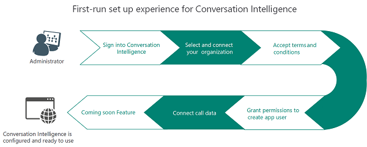
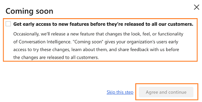

# First-run set up experience of Conversation Intelligence

When you sign-in to Conversation Intelligence, the application will be available for you to use and explore the various features through the provided demo data.
After you sign in, you can set up the application depending on the role that is assigned to you.

-	As an administrator, you can set up the complete application including connecting Dynamics 365 Sales environment, grant app permissions, connect call data, enable preview, and define tracked key words and competitors to use the features that the application offers. To learn more, see [Administrator setting up application](#administrator-setting-up-application).

-	As a sales manager or seller, you can access the application with demo data and administrator must configure the application to view the data relevant to you.

## Administrator setting up application

The following diagram illustrates the process of setting up application as an administrator:

> [!div class="mx-imgBorder"]
> 

1.	Review the perquisites. To learn more, see [Prerequisites to setup Conversation Intelligence](prereq-sales-insights-app.md).

2.	Sign in to **Conversation Intelligence** application as administrator.

    > [!div class="mx-imgBorder"]
    > 
 
3.	Select **Set up Conversation Intelligence** and continue with the set up wizard. 

4.	On the **Connect your data** dialog box, select your Dynamics 365 Sales environment to connect with the application.

    > [!div class="mx-imgBorder"]
    > 
  
    The application detects your environment.

5.	On the **Terms and conditions** dialog box, carefully read and select the [Microsoft privacy statement](https://privacy.microsoft.com/privacystatement) and [terms and conditions](https://www.microsoft.com/licensing/product-licensing/products). Select **Agree and continue**.

    > [!div class="mx-imgBorder"]
    > 

    >[!NOTE]
    >Selecting the first check box, allows Microsoft to collect your organization's data to improve the quality of insights. This check box is optional.

    The application takes few minutes to connect your data with application and progress dialog box is displayed.
 
    > [!div class="mx-imgBorder"]
    > 
  
6.	On the **Create an application user** dialog box, select **Grant permissions** to create application user to use the application.

    > [!div class="mx-imgBorder"]
    > 
 
    The permission is granted to use the application.

7.	On the **Connect your call data** dialog box, enter the **Storage connection string** and **Container name** and select **Connect**.
    
    To learn more on how to get these values, see [Configure conversation intelligence to connect call data](configure-conversation-intelligence-call-data.md).

    > [!div class="mx-imgBorder"]
    > 
 
8.	If you want to turn the coming soon feature, on the **Coming soon** dialog box, select the preview feature and then select **Agree and continue**.

    > [!div class="mx-imgBorder"]
    > 
 
    > [!NOTE]
    > If you don’t want to enable the preview feature for your organization, skip this step to proceed. You can always enable the preview features later. To learn more, see [Enable coming soon features](enable-preview-features-sales-insights-app.md).

9.	On the **Keyword and competitor tracking** dialog box, add the keywords and competitors that you want to track on the call. You can update these keywords and trackers later when your organization requires a change. To learn more, see [Configure keywords and competitors in Conversation content](configure-keywords-competitors.md).

    > [!NOTE]
    > You can also skip adding the keywords and competitors and add them later when required.

    > [!div class="mx-imgBorder"]
    > 
 
10.	Select **Finish** to complete the set-up of Conversation Intelligence for your organization.

    The status message will be displayed on the top of the page.

    > [!div class="mx-imgBorder"]
    > 
  
Now, your Conversation Intelligence is ready, and managers and sellers can use to view this data.

### See also

[Introduction to administer Conversation Intelligence](intro-admin-guide-sales-insights.md#administer-conversation-intelligence)

[Prerequisites to use Conversation Intelligence](prereq-sales-insights-app.md)