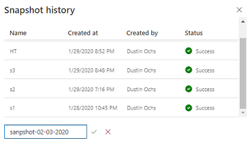

# Manage snapshots for a forecast

A snapshot freezes the forecast data at a moment in time. The frozen data includes aggregate column values, manual adjustments, and underlying record fields that directly affect the forecast. You can use these snapshots to see how the forecast and its underlying data have changed over time.

To visualize the flow of forecast data between two snapshots, use a flow chart. To learn more, see [Analyze deals flows between snapshots](analyze-deals-flow-between-snapshots.md).

## Prerequisites

Review the following prerequisites before you start using snapshots:

-	Purchase a Dynamics 365 Sales Insights license or start a trial to use advanced Sales Insights features.

-	Only users who have the security roles required to create and write in the forecast configuration can create snapshots. To learn more, see [Security roles and privileges](https://docs.microsoft.com/power-platform/admin/security-roles-privileges).

## Create a snapshot

Before you create a snapshot for a forecast, note the following:

-	Snapshots are available for active forecasts only.

-	You can capture one forecast snapshot per day. However, if you want to take another snapshot, you can delete the most recent snapshot and then capture a new one.

-	You can't take snapshots for an active forecast that's either entirely in the past or entirely in the future. For example, if it's currently January 25, 2020 and your forecast has an end date of January 24, 2020, you won't be able to take a snapshot of this forecast because its end date has already passed.

- Snapshots save only the system-calculated forecast values and will not consider the adjusted values. To learn more, see [Adjust values in a forecast](https://docs.microsoft.com/dynamics365/sales-enterprise/adjust-values-in-forecast).

**To create snapshots**

1.	Sign in to the Sales Hub app.

2.	At the bottom of the site map, select the **Change area** icon, and then select **App settings**.

3.	Under **Performance management**, select **Forecast configurations**.

4.	On the forecast grid page, select the **Active** tab. A list of active configured forecasts is displayed.

    > [!div class="mx-imgBorder"]
    > 

5.	On the forecast from which you want to create a snapshot, select the **More options** icon, and then select **Add/view snapshots**.

    > [!div class="mx-imgBorder"]
    > 

    The snapshot history page opens. A list of snapshots is displayed if there are snapshots already created for the forecast.

6.	In the **Snapshot history** dialog box, select **+ Add snapshot**.

7.	Enter a name for the snapshot, and then select the check mark.

    > [!div class="mx-imgBorder"]
    > 

8.	In the confirmation message that appears, select **Create**. 

The snapshot list is refreshed to display the added snapshot, and you can verify its progress in the status column.

## Delete a snapshot

1.	In the forecast, select the **More options** icon, and then select **Add/view snapshots**. 

    > [!div class="mx-imgBorder"]
    > 

    The snapshot history dialog opens with a list of snapshots.

2.	Select the **More options** icon corresponding to the snapshot and the select **Delete**.
 
    > [!div class="mx-imgBorder"]
    > 
 
    A confirmation message is displayed. 

3.	Select **Delete**. 

The snapshot list is refreshed, and the deleted snapshot is removed from the list.

### See also

[About premium forecasting](configure-premium-forecasting.md) 
[Analyze deals flow between snapshots](analyze-deals-flow-between-snapshots.md)