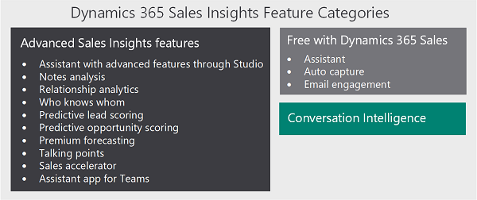

# Overview of Dynamics 365 Sales Insights

Welcome to [!INCLUDE[pn-dynamics-sales-insights](../includes/pn-dynamics-sales-insights.md)].

[!INCLUDE[pn-dynamics-sales-insights](../includes/pn-dynamics-sales-insights.md)] is a suite of features that continuously analyze the vast collection of customer-interaction data already stored in your Dynamics 365 Sales and Office 365 databases. This helps you to better understand your business relationships, evaluate your activities in relation to previous successes, and choose the best path forward. Also, it enables you to build strong relationships with customers, take actions based on insights, and close opportunities faster. These features are categorized as follows: 

- [Free Sales Insights features](#free-sales-insights-features) 

- [Advanced Sales Insights features](#advanced-sales-insights-features)

- [Conversation Intelligence](#conversation-intelligence) 

The following diagram illustrates the various features available in [!INCLUDE[pn-dynamics-sales-insights](../includes/pn-dynamics-sales-insights.md)]: 

> [!div class="mx-imgBorder"]
> 

## Free Sales Insights features 

These Sales Insights features are available for free with Dynamics 365 Sales: 

- **Assistant (free)**: The assistant (formerly known as Relationship assistant) combines and analyzes the information that is at its disposal from Dynamics 365 Sales, and then generates a collection of action cards that are displayed as your entry point to Dynamics 365 Sales on mobile devices, and as a carousel or column display on your web-based dashboards. To learn more, see  [Use assistant to guide customer communications](assistant.md). 

- **Auto capture (free)**: The auto capture analyzes your email messages directly in Microsoft Exchange to find all messages that might be relevant to your work in sales. The application looks for messages to or from relevant email addresses and presents you with the relevant messages right in Sales. To learn more, see [Auto capture of related emails](auto-capture.md). 

- **Email engagement (free)**: The email engagement helps you create more effective email messages—and learn how your contacts are interacting with them. Stay on top of your email and prioritize those prospects or customers that are most engaged. To learn more, see [Use email engagement to view message interactions](email-engagement.md). 

## Advanced Sales Insights features 

The advanced Sales Insights features consist of the [free Sales Insights features](#free-sales-insights-features) along with the following features: 

- **Assistant with Studio (full capabilities)**: Consists of base assistant capabilities along with enhanced features that allow you to create and display custom insight cards using the Studio to users. The Studio helps you to create custom insight cards through Microsoft Flow. After you create the cards, you can configure prioritization and who can see the cards. To learn more, see [Manage insight cards](manage-custom-cards-flow.md). 

- **Relationship analytics**: Gathers information from Dynamics 365 Sales for key performance indicators (KPIs) and activity histories, and displays it in a graphical representation. To learn more, see [Use Relationship analytics to gather KPIs](relationship-analytics.md). 

- **Predictive lead scoring**: Helps you to focus on revenue generation efforts by providing a score to prioritize efforts on quality leads. To learn more, see [Prioritize leads through scores](work-predictive-lead-scoring.md). 

- **Predictive opportunity scoring**: Helps you to focus on revenue generation efforts by providing a score to prioritize efforts on quality opportunities. To learn more, see [Prioritize opportunities through scores](work-predictive-opportunity-scoring.md). 

- **Premium forecasting**: Helps you to focus on revenue generation efforts by providing forecast projections based on sales pipeline and historical data. To learn more, see [Analyze revenue outcome using predictive forecasting](analyze-revenue-outcome-using-predictive-forecasting.md).

- **Notes analysis**: Monitors notes that you enter regarding a recent meeting or discussion with your customer to provide intelligent suggestions. To learn more, see [How notes analysis assists you with suggestion](notes-analysis.md). 

- **Talking points**: Displays topics to start a conversation with your customer such as sports, vacation, family, and entertainment. To learn more, see [Know conversation starters for your customers](talking-points.md). 

- **Who knows whom**: Provides details such as names and email addresses of your colleagues who know a lead that you are going to interact with. To learn more, see [How to get introduced to a lead](who-knows-whom.md). 

- **Sales accelerator**: Helps sales teams in organizations to focus on high-velocity selling by a tailored experience for sellers by minimizing the time spent on identifying who is the next best customer to reach, gathering information across multiple sources, and focus on how approaching customers.  To learn more, see [What is sales accelerator](sales-accelerator-intro.md).

- **Dynamics 365 assistant for Microsoft Teams**: Provides sellers with timely and in-context intelligent guidance across the sales journey so that sellers can spend more time building relationships with their customers. To learn more, see [Overview of Dynamics 365 assistant](overview-dynamics-365-assistant-app-teams.md). 

## Conversation Intelligence 

Conversation Intelligence provides you with the information and insights to intelligently manage the sales team, proactively coach sellers, and quickly answer questions regarding the business. To achieve this, the Dynamics 365 Conversation Intelligence provides you with information through key performance indicators (KPIs) for pipeline and deals, and intelligent call data KPIs through conversations intelligence. 

The features in Conversation Intelligence are specifically designed to help sales managers and sellers to intelligently manage and quickly answer their most important business questions.

> [!NOTE]
> You must purchase a **[!INCLUDE[pn-dynamics-sales-insights](../includes/pn-dynamics-sales-insights.md)]** license to use Dynamics 365 Sales Insights features.

The following features are available under the Dynamics 365 Sales Insights app:  

- Overall sales and seller insights
- Team report
- Conversation intelligence

To learn more, see [Improve seller coaching and sales potential with Dynamics 365 Conversation Intelligence](dynamics365-sales-insights-app.md).

## For effective use of Sales Insights

For effective use of Dynamics 365 Sales Insights, use the out-of-the-box entities (contact, opportunity, lead, account, and case) while creating records in the application. If changes to the entity are required in your organization, customize only these out-of-the-box entities to meet your requirements. This helps the application to analyze the records, and generate models and predictions effectively.

### See also

[Introduction to administer Sales Insights](../sales/intro-admin-guide-sales-insights.md)

[Sales Insights privacy notice](privacy-notice.md)